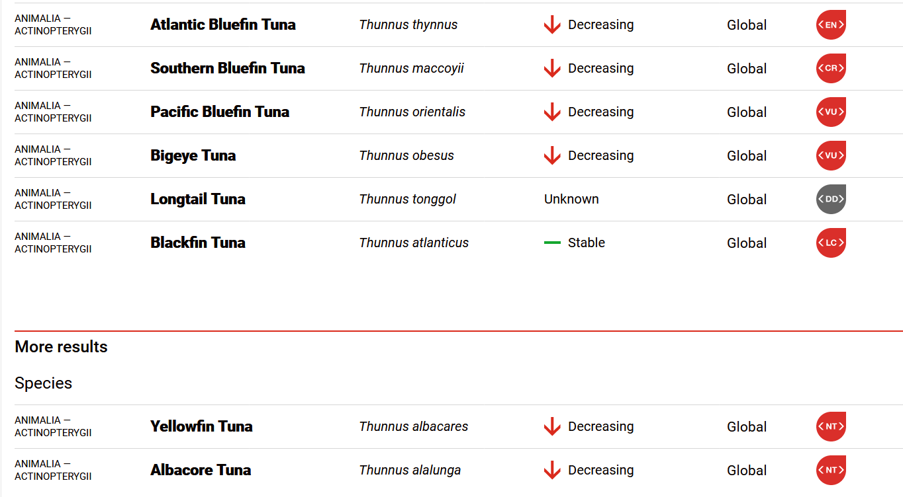
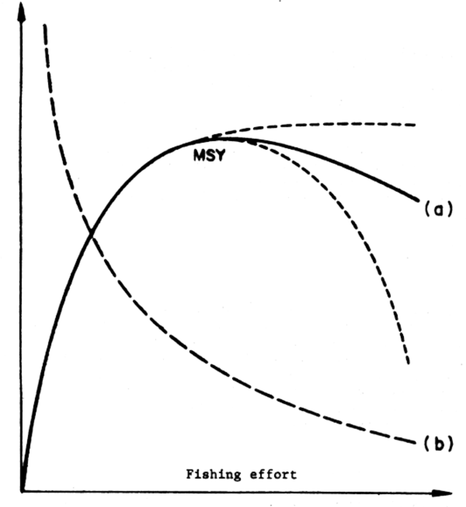
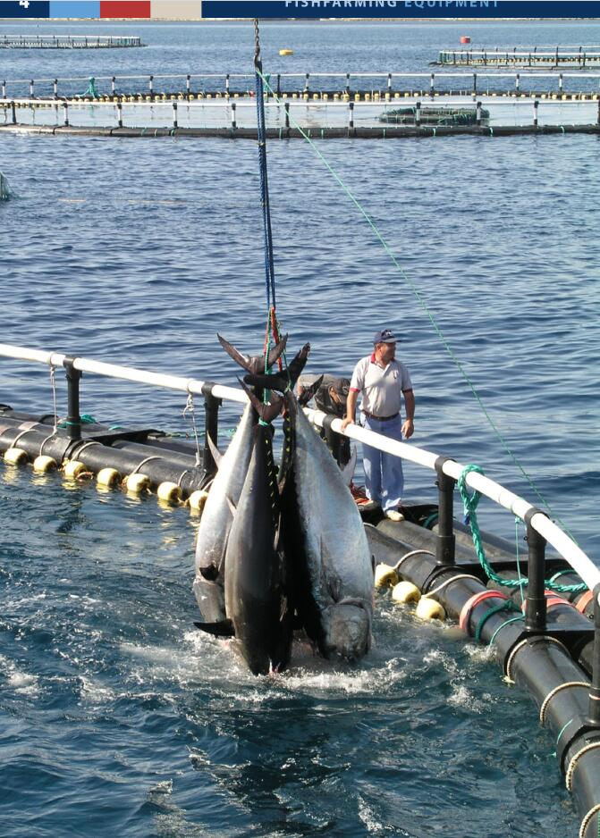

```{r setup, include=FALSE}
knitr::opts_chunk$set(echo = FALSE)
```

# 1. Intro {.tabset}

## 1.1 Greetings {.tabset}

Helo, Welcome to My Rmd In this Rmd I would explore about Tuna

## 1.2 Brief {.tabset}

I want to visualize some graphs to inform a Tuna condition

## 1.3 Problem Background {.tabset}

Atlantic Bluefin Tuna now is endangered because overexploited, I want to find out current condition. <br>
1. Which species are the most exploited? <br>
2. Which countries exploit the most? <br>
3. What is the solution to the current condition?

```{r, echo=FALSE, out.width="50%", fig.cap="Red List Tuna."}

```

## 1.4 Library {.tabset}

```{r, echo=TRUE, warning=FALSE, message=FALSE}
library(tidyverse)
library(readr)
library(ggthemes)
library(plotly)
```

## 1.5 Dataset {.tabset}

Dataset is from FAO Fisheries Division <br> "FAO Aquaculture, Capture and Global production databases with data from 1950 to 2018"

```{r, echo=TRUE, warning=FALSE, message=FALSE}

country <- read_csv("input_fish/CL_FI_COUNTRY_GROUPS.csv")
production <- read_csv("input_fish/CL_FI_PRODUCTION_SOURCE.csv")
species <- read_csv("input_fish/CL_FI_SPECIES_GROUPS.csv")
symbol <- read_csv("input_fish/CL_FI_SYMBOL.csv")
unit <- read_csv("input_fish/CL_FI_UNIT.csv")
waterarea <- read_csv("input_fish/CL_FI_WATERAREA_GROUPS.csv")
TS <- read_csv("input_fish/TS_FI_PRODUCTION.csv")

```

# 2. Data Wrangling

## 2.1 Filter the Species

I looking for the names of colomn

```{r, echo=TRUE, message=FALSE, warning=FALSE}
names(species) #Check colomn names
```

I use three colomn '3Alpha_Code', Name_En and Scientific_Name to extract the code

```{r, echo=TRUE, message=FALSE, warning=FALSE}
Nama_Tuna <- species %>% 
  select('3Alpha_Code', Name_En, Scientific_Name) %>% 
  filter(Name_En %in% c("Atlantic bluefin tuna", "Southern bluefin tuna", "Pacific bluefin tuna", "Bigeye tuna", "Albacore", "Longtail tuna", "Blackfin tuna", "Yellowfin tuna")) #Filtering species
```

----

### Species

```{r, echo=TRUE, message=FALSE, warning=FALSE}
Nama_Tuna
```
The code has been extracted, next replace the code with species names

----

### Decode - Encode

I use Time Series dataset from 1950 to 2018

```{r, echo=TRUE, message=FALSE, warning=FALSE}
TUNA <- TS %>% 
  filter(SPECIES %in% c("BFT", 
                        "PBF", 
                        "LOT", 
                        "BLF", 
                        "ALB", 
                        "SBF", 
                        "YFT", 
                        "BET"),
         YEAR %in% 1950:2018)
```

----

### Replacing

I using sapply function for this step

```{r, echo=TRUE, message=FALSE, warning=FALSE}
TUNA$SPECIES <- sapply(as.character(TUNA$SPECIES), switch, 
                       "BFT" = "Atlantic Bluefin Tuna",
                       "PBF" = "Pacific Bluefin Tuna", 
                       "LOT" = "Longtail Tuna", 
                       "BLF" = "Blackfin Tuna", 
                       "ALB" = "Albacore",
                       "SBF" = "Southern Bluefin Tuna", 
                       "YFT" = "Yellowfin Tuna",
                       "BET" = "Bigeye Tuna")
```


## 2.2 The Country

Now, country who harvesting Tuna. There are 21 top country I got from FAO and then I filtering from country dataset

```{r, echo=TRUE, message=FALSE, warning=FALSE}
topFAO <- country %>% 
  filter(Name_En %in% c("Thailand", "Spain", "Ecuador", "Taiwan Province of China", "China", "Indonesia", "Korea, Republic of", "Viet Nam", "Philippines", "Netherlands", "Mauritius", "Japan", "United States of America", "Italy", "France", "Germany", "United Kingdom", "Australia", "Canada", "Portugal", "Saudi Arabia")) %>% 
  select(UN_Code, Name_En)
```

OK, I got the code of country

----

### Filter Code of Country

```{r, echo=TRUE, message=FALSE, warning=FALSE}
TUNA <- TUNA %>% 
  filter(COUNTRY %in% c("036", "124", "156", "158", "218", "250", "276", "360", "380", "392", "410", "480", "528", "608", "620", "682", "704", "724", "764", "826", "840"))
```

After that I do the same things like before on Species

### Decode - Encode {.smaller}

```{r, echo=TRUE, message=FALSE, warning=FALSE}
TUNA$COUNTRY <- sapply(as.character(TUNA$COUNTRY), switch, 
                            "036" = "Australia",
                            "124" = "Canada", 
                            "156" = "China", 
                            "158" = "Taiwan Province of China", 
                            "218" = "Ecuador",
                            "250" = "France", 
                            "276" = "Germany",
                            "360" = "Indonesia",
                            "380" = "Italy",
                            "392" = "Japan", 
                            "410" = "Korea, Republic of", 
                            "480" = "Mauritius", 
                            "528" = "Netherlands",
                            "608" = "Philippines", 
                            "620" = "Portugal",
                            "682" = "Saudi Arabia",
                            "704" = "Viet Nam",
                            "724" = "Spain", 
                            "764" = "Thailand", 
                            "826" = "United Kingdom", 
                            "840" = "United States of America")
```

## 2.3 Fishing Ground {.smaller}

Now, where the fish is capturing. The Fishing ground

```{r, echo=TRUE, message=FALSE, warning=FALSE}
fishing_ground <- waterarea %>% 
  filter(Code %in% c("77", "87", "21", "67", "61", "71", "27", "31", "51", "57", "81", "34", "37", "47", "41")) %>% 
  select(Code, Name_en)
```

```{r, echo=TRUE, message=FALSE, warning=FALSE}
TUNA$AREA <- sapply(as.character(TUNA$AREA), switch,
                    "77" = "Pacific, Eastern Central",
                    "87" = "Pacific, Southeast",
                    "21" = "Atlantic, Northwest",
                    "67" = "Pacific, Northeast",
                    "61" = "Pacific, Northwest",
                    "71" = "Pacific, Western Central",
                    "27" = "Atlantic, Northeast",
                    "31" = "Atlantic, Western Central",
                    "51" = "Indian Ocean, Western", 
                    "57" = "Indian Ocean, Eastern",
                    "81" = "Pacific, Southwest",
                    "34" = "Atlantic, Eastern Central",
                    "37" = "Mediterranean and Black Sea",
                    "47" = "Atlantic, Southeast",
                    "41" = "Atlantic, Southwest")
```

## 2.4 Source 

Another to hervesting the Tuna is from Marine Aquaculture

```{r, echo=TRUE, message=FALSE, warning=FALSE}
TUNA$SOURCE <- sapply(as.character(TUNA$SOURCE), switch,
                      "3" = "Marine Aquaculture",
                      "4" = "Capture Fisheries")
```

## 2.5 Sub-Genus

In this step I did a little future enginering, create a new colomn ._.

```{r}
TUNA <- TUNA %>% 
  select(-UNIT, -SYMBOL)

Thunnus <- TUNA
```


```{r, echo=TRUE, message=FALSE, warning=FALSE}
Thunnus <- Thunnus %>% 
  mutate(FIN = SPECIES)
```

Next, species grouping by their sub-genus

```{r, echo=TRUE, message=FALSE, warning=FALSE}
Thunnus$FIN <- sapply(as.character(Thunnus$FIN), switch, 
                      "Atlantic Bluefin Tuna" = "Bluefin",
                      "Pacific Bluefin Tuna" = "Bluefin", 
                      "Longtail Tuna" = "Yellowfin", 
                      "Blackfin Tuna" ="Yellowfin", 
                      "Albacore" = "Bluefin",
                      "Southern Bluefin Tuna" = "Bluefin", 
                      "Yellowfin Tuna" = "Yellowfin",
                      "Bigeye Tuna" = "Bluefin")
```

```{r}
Thunnus <- Thunnus %>% 
  rename(Country = COUNTRY, 
         Fishing_Ground = AREA, 
         Source = SOURCE, 
         Species = SPECIES, 
         Year = YEAR, 
         Quantity = QUANTITY, 
         Fin = FIN)

Thunnus$Year <- as.factor(Thunnus$Year)
Thunnus$Fin <- as.factor(Thunnus$Fin)
Thunnus$Species <- as.factor(Thunnus$Species)
Thunnus$Fishing_Ground <- as.factor(Thunnus$Fishing_Ground)
```

# 3 EDA | Exploratory Data Analysis

## 3.1 Total Catch by Fishing Ground 

```{r}

Thunnus %>% 
            select(Country, Species, Source, Year, Quantity, Fishing_Ground) %>% 
            filter(Year == 2018,
                   Fishing_Ground == "Pacific, Southeast") %>% 
            group_by(Species) %>% 
            summarise(Quantity = sum(Quantity)) %>% 
            #arrange(QUANTITY) %>% 
            ggplot(mapping = aes(x = Quantity,
                                 y = reorder(Species, Quantity))) +
            geom_col(mapping = aes(fill = Species)) +
            theme(legend.position = "none")

```

Pacific, Southeast is the closest ocean to Indonesia, it could be that Indonesian fishermen catch tuna at this fishing ground. The species most frequently capture is Yellowfin Tuna, which is NT IUCN status or near threatened. However, if they are almost threatened, then are they the most worthy of exploitation?

## 3.2 Total Yearly Catch by Sub-Genus

```{r}

Thunnus %>% 
            select(Species, Fin, Year, Quantity) %>% 
            filter(Year == 2018) %>% 
            group_by(Fin) %>% 
            summarise(Quantity = sum(Quantity)) %>% 
            plot_ly(labels = ~Fin, 
                    values = ~Quantity, 
                    type = 'pie')

```

## 3.3 Total Yearly Catch by Species

```{r}
Thunnus %>% 
  select(Species, Fin, Year, Quantity) %>% 
  filter(Year == 2018) %>% 
  group_by(Species) %>% 
  summarise(Quantity = sum(Quantity)) %>% 
    plot_ly(labels = ~Species, 
            values = ~Quantity, 
            type = 'pie')

```

## 3.4 Total Yearly Catch by Country

```{r}
Thunnus %>% 
  select(Country, Species, Source, Year, Quantity) %>% 
  filter(Year == 2018) %>% 
  group_by(Country) %>% 
  summarise(Quantity = sum(Quantity)) %>% 
  #arrange(QUANTITY) %>% 
  ggplot(mapping = aes(x = Quantity,
                       y = reorder(Country, Quantity))) + 
      geom_col(mapping = aes(fill = Country)) +
      theme(legend.position = "none")
```

## 3.5 Time Series

### Blue Fin X Yellow Fin (1950 - 2018)

```{r, message=FALSE, warning=FALSE}
Thunnus %>% 
            filter(Source == "Capture Fisheries",
                   Year %in% 1950:2018) %>% 
            select(Species, Fin, Year, Quantity) %>% 
            group_by(Fin, Year) %>% 
            summarise(Quantity = sum(Quantity)) %>% 
            arrange(-Year) %>% 
            ggplot(mapping = aes(x = Year,
                                 y = Quantity,
                                 color = Fin,
                                 group = Fin)) +
            geom_line() +
            geom_point() +
            geom_vline(xintercept = 31, linetype="dashed", 
                       color = "blue", size= 1) +
            theme(legend.position = "none",
                  axis.text.x = element_text(angle = 90, size = 7, vjust =0.5, margin=margin(5,0,0,0)))
    
```

## 3.6 Trend

### Sub-Genus Yellowfin Tuna

```{r, warning=FALSE, message=FALSE}
Thunnus %>% 
            filter(Source == "Capture Fisheries",
                   Year %in% 1988:2018,
                   Fin == "Yellowfin") %>% 
            select(Species, Fin, Year, Quantity) %>% 
            group_by(Fin, Year) %>% 
            summarise(Quantity = sum(Quantity)) %>% 
            arrange(-Year) %>% 
            ggplot(mapping = aes(x = Year,
                                 y = Quantity,
                                 color = Fin,
                                 group = Fin)) +
            geom_line() +
            geom_point() +
            geom_smooth(method = "lm") +
            theme(legend.position = "none",
                  axis.text.x = element_text(angle = 90, size = 7, vjust =0.5, margin=margin(5,0,0,0)))
```


### Sub-Genus Bluefin Tuna

```{r, warning=FALSE, message=FALSE}
        Thunnus %>% 
            filter(Source == "Capture Fisheries",
                   Year %in% 1988:2018,
                   Fin == "Bluefin") %>% 
            select(Species, Fin, Year, Quantity) %>% 
            group_by(Fin, Year) %>% 
            summarise(Quantity = sum(Quantity)) %>% 
            arrange(-Year) %>% 
            ggplot(mapping = aes(x = Year,
                                 y = Quantity,
                                 color = Fin,
                                 group = Fin)) +
            geom_line() +
            geom_point() +
            geom_smooth(method = "lm") +
            theme(legend.position = "none",
                  axis.text.x = element_text(angle = 90, size = 7, vjust =0.5, margin=margin(5,0,0,0)))

```

## 3.7 Capture vs Culture

```{r}
        Thunnus %>% 
            select(Source, Year, Quantity) %>% 
            filter(Year == 2018) %>% 
            group_by(Source) %>% 
            summarise(Quantity = sum(Quantity)) %>% 
            plot_ly(labels = ~Source, 
                    values = ~Quantity, 
                    type = 'pie', 
                    title = "Total Catch by Source in 2018",
                    textinfo = "none")
        
```

## 3.8 The Rising of Marine Aquaculture 

```{r, warning=FALSE, message=FALSE}
        Thunnus %>% 
            filter(Source == "Marine Aquaculture",
                   Year %in% 1980:2018) %>% 
            select(Species, Fin, Year, Quantity) %>% 
            group_by(Fin, Year) %>% 
            summarise(Quantity = sum(Quantity)) %>% 
            arrange(-Year) %>% 
            ggplot(mapping = aes(x = Year,
                                 y = Quantity,
                                 color = Fin,
                                 group = Fin)) +
            geom_line()+
            geom_point() +
            geom_vline(xintercept = 31, linetype="dashed", 
                       color = "blue", size= 1) +
            theme(legend.position = "none",
                  axis.text.x = element_text(angle = 90, size = 7, vjust =0.5, margin=margin(5,0,0,0)))
```

# 4. Solution

## 4.1 Maximum Sustainable Yield

```{r, echo=FALSE, out.width="50%", fig.cap="MSY Concept."}

```

Maximum sustainable yield is a concept, conservation of fishery resources is very necessary. By using the MSY concept, it is expected to be able to maintain sustainability

## 4.2 Marine Aquaculture

```{r, echo=FALSE, out.width="50%", fig.cap="Marine Aquaculture."}

```
Marine aquaculture in the future will be a solution to overexploitation of tuna 

# 5. Reference
<http://www.fao.org/fishery/statistics/global-production/en> <br>
Cover photo by <a href="https://unsplash.com/@prongs94?utm_source=unsplash&utm_medium=referral&utm_content=creditCopyText">kate</a> on <a href="https://unsplash.com/s/photos/tuna?utm_source=unsplash&utm_medium=referral&utm_content=creditCopyText">Unsplash</a> <br>
This article also available on [Medium]() and [Rpubs]()
  


