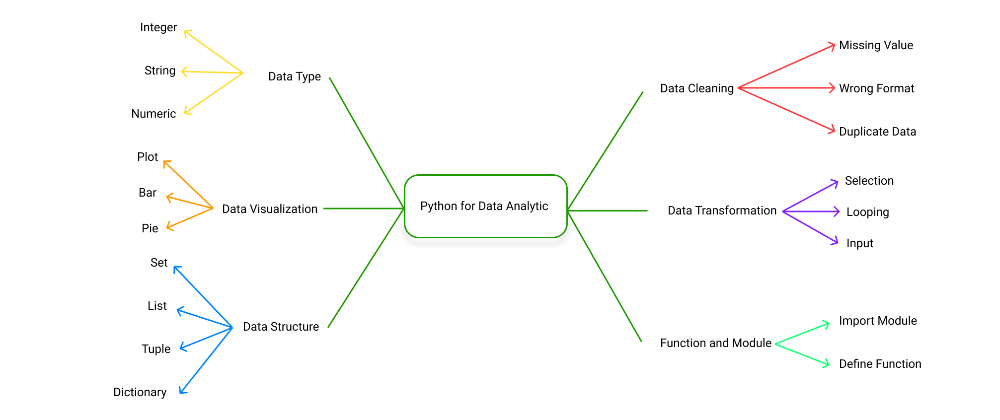

```{r setup, include=FALSE}
knitr::opts_chunk$set(echo = TRUE)
```


# Python

Python merupakan sebuah open source, high level programming language dan juga menyediakan service yang bagus untuk object-oriented programming. Python merupakan salah satu bahasa pemrograman terbaik yang digunakan di bidang data science oleh para data scientist, analyst dan lain lain. Python menyediakan functionality yang bagus saat berhubungan dengan matematika statistik dan fungsi scientific. 

Python merupakan bahasa pemrograman yang berurutan dan sistematis, sehingga dibaca dari atas ke bawah

Software yang digunakan untuk pemrograman Python ini dinamakan Jupyter Notebook. Alasan Jupyter Notebook digunakan pada 
pemrograman ini karena layanan cloud yang ditawarkan sehingga praktis untuk menggunakannya

Tempat code ditulis ini dinamakan cell, dimana baik code ataupun keterangan ditulis. Untuk menjalankan code cell yang diinginkan digunakan command SHIFT + ENTER lalu cell akan otomatis ditambahkan

'#' merupakan simbol yang digunakan untuk comment, dimana nantinya jupyter notebook tidak akan membacanya sebagai sebuah code


```python
from IPython.display import Image
Image("asset/Mind Map.png")
```
    

    


# Variabels

Variabel merupakan sebuah kontainer atau tempat penyimpanan untuk menyimpan nilai sebuah data. Variabel dibuat disaat sebuah data disimpan ke dalam tempat tersebut. Untuk mengassign nilai terhadap sebuah variabel, digunakan simbol =

Terdapat beberapa ketentuan dalam penamaan variabel di dalam python

#### 1. Sebuah variabel harus dimulai dari huruf atau underscore(_)


```python
x = 7
_x = 6
```

    7


#### selain itu, maka akan terjadi error


```python
-x = 8
*r = 0
```


      File "<ipython-input-5-d6f2de8f0927>", line 1
        -x = 8
        ^
    SyntaxError: cannot assign to operator


#### 2. Sebuah variabel tidak bisa dimulai dengan angka


```python
4y = 10
15i = 25
```


      File "<ipython-input-6-5b308d401a72>", line 1
        4y = 10
         ^
    SyntaxError: invalid syntax


#### Case Sensitive

Case Sensitive memiliki pengertian dimana huruf besar dan huruf kecil memiliki perbedaan.


```python
b = 20
B = 30
```


```python
b
```


```python
B
```


    10


#### Multiple Variabel

Merupakan fitur dimana bisa menetapkan nilai ke beberapa variabel dalam satu baris code


```python
a,b,c = 3,9,10
```


```python
a
```


    3


```python
c
```


    10


#### Output Variabel

Output variabel merupakan nilai yang akan ditampilkan pada bagian code, untuk menampilkannya bisa menggunakan command print()


```python
a = 10
b = 20
print(a,b) #merupakan fungsi untuk mengeluarkan output dari a dan b
```

    10 20


```python
nama = "Fajar"
```


```python
nama
```


    'Fajar'


```python
print(nama)
```

    Fajar


# Data Type in Python

Tipe data sama dengan jenis data, yang merupakan hal penting di dalam Python. Terdapat beberapa jenis Tipe data yang sering digunakan dalam Python mulai dari Numeric dan text type

Untuk memeriksa tipe data dari variabel, digunakan command type()

### Numeric Type

Merupakan tipe data yang menampung jenis data berupa angka baik angka decimal maupun bilangan bulat. Numeric type terdiri dari 3 tipe yaitu,

#### Integer/Int

Integer digunakan untuk menampung jenis data bertipe numeric atau angka dalam bentuk bilangan bulat


```python
a = 1000
type(a)
```


    int


#### Float

Float digunakan untuk menampung jenis data bertipe decimal 


```python
b = 20.6
type(b)
```


    float


#### Complex

Complex digunakan untuk menampung jenis data yang memiliki variasi, namun tipe ini jarang digunakan


```python
c = 3+14j
print(type(c))

compleks = 3.14647148148145481
print(type(compleks))
```

    <class 'complex'>
    <class 'float'>


### Boolean

Boolean merepresentasikan dua nilai, yaitu True dan False


```python
is_animal = True, False, True, True
is_animal
```


    (True, False, True, True)


```python
print(type(is_animal))
```

    <class 'tuple'>


```python
3 > 4
```


    False


```python
3 == 5
```


    False


#### Boolean juga diibaratkan sebagai angka dalam operasi matematika, yaitu True bernilai 1 dan False bernilai 0


```python
 1 + True
```


    2


```python
1 + False
```


    1


### Text Type

Merupakan tipe data yang menampung huruf/kata dan ditandai dengan penggunaan tanda kutip. Apabila nilai yang di tampung angka, namun ditambahkan tanda kutip, maka python tetap akan membacanya sebagai string


```python
text = "Hello Python"
type(text)
```


    str


```python
text2 = "2"
type(text2)
```


    str


Untuk menggabungkan dua teks, bisa digunakan tanda +


```python
temp = "Hello Bob "
temp2 = "How are you?"
```


```python
temp + temp2
```


    'Hello Bob How are you?'


Terdapat beberapa method yang bisa digunakan untuk membantu dalam penerapan string

#### Lower

Digunakan untuk mengubah huruf menjadi huruf kecil


```python
string = "HELLO MY NAME IS LOWER"
lower = string.lower()
print(lower)
```

    hello my name is lower


```python
x = "HELLO WORLD"
x1 = x.lower()
x1
```


    'hello world'


```python
# variable.function() <- syntax basic
```

#### Upper

Digunakan untuk mengubah huruf menjadi huruf besar


```python
string = "hello my name is upper"
upper = string.upper()
print(upper)
```

    HELLO MY NAME IS UPPER


#### Replace

Digunakan untuk mengganti kata menjadi sebuah kata lain


```python
text = "Hello my name is John"
replace = text.replace("John","Tiery") # -> "apa yg ingin di ganti","di ganti dengan apa"
print(replace)
```

    Hello my name is Tiery


#### Split

Digunakan untuk memisah sebuah value sesuai dengan parameter yang diberikan


```python
fruit = "Apple Banana Orange Melon"
split = fruit.split(" ")
print(split)
```

    ['Apple', 'Banana', 'Orange', 'Melon']


#### Format

Digunakan untuk memasukkan value dalam placeholder yang dibuat, placeholdernya ditandai dengan tanda {}


```python
string = "My name is {name} and i am {age} years old, i do {doing}"
print(string.format(name="Python",age=20,doing="coding"))
```

    My name is Python and i am 20 years old, i do coding


#### Len

Digunakan untuk menghitung panjang (Lenght) dari sebuah kata/kalimat


```python
string = "My name is Python"
print(len(string))
```

    17


#### Untuk memeriksa variabel apa saja yang telah dibuat, digunakan command %whos


```python
%whos
```

    Variable   Type       Data/Info
    -------------------------------
    a          int        1000
    b          float      20.6
    c          complex    (3+14j)
    compleks   float      3.1464714814814547
    fruit      str        Apple Banana Orange Melon
    nama       str        Fajar
    replace    str        Hello my name is Tiery
    split      list       n=4
    string     str        My name is Python
    temp       str        Hello Bob 
    temp2      str        How are you?
    text       str        Hello my name is John
    text2      str        2
    x1         str        hello world


#### Untuk menghapus variabel yang telah dibuat, menggunakan command del


```python
del x1
%whos
```

    Variable   Type       Data/Info
    -------------------------------
    a          int        1000
    b          float      20.6
    c          complex    (3+14j)
    compleks   float      3.1464714814814547
    fruit      str        Apple Banana Orange Melon
    nama       str        Fajar
    replace    str        Hello my name is Tiery
    split      list       n=4
    string     str        My name is Python
    temp       str        Hello Bob 
    temp2      str        How are you?
    text       str        Hello my name is John
    text2      str        2


### Convert Data Type

Python memungkinkan bahwa setiap tipe data, diganti menjadi tipe data yang lain, yaitu dengan menggunakan command tipe data yang diinginkan


```python
# function(variable)
```

#### Integer to Float


```python
a = 10
a = float(a)
print(a)
print(type(a))
```

    10.0
    <class 'float'>


```python
b = 20
print(float(b))
```

    20.0


#### Float to Integer


```python
c = 31.9
c = int(c)
c
print(type(c))
```

    <class 'int'>


```python
d = 50.0
print(int(d))
```

    50


#### Integer to String


```python
e = 20
e = str(e)
print(type(e))
print(e)
```

    <class 'str'>
    20


```python
f = 40
print(str(f))
```

    40


#### Float to String


```python
g = 40.5
g = str(g)
print(type(g))
print(g)
```

    <class 'str'>
    40.5


```python
h = 50.6
print(str(h))
```

    50.6


#### String to Integer


```python
i = "40"
i = int(i)
type(i)

```


    int


#### String to float


```python
j = "50.5"
j = float(j)
type(j)
```


    float


# List, Tuple, Set, Dictionary

### List

List merupakan sebuah data type bertipe built in pada Python yang digunakan untuk menyimpan banyak nilai pada satu variabel. List bisa menampung tipe data yang berbeda, seperti string, int, float dan lain lain.

Untuk mengakses nilai pada list, digunakan index, pada python index dimulai dari angka 0.

List ditandai dengan simbol [ ]. 


```python
List = ["Red", "Blue", "Green"]
print(List)
```

    ['Red', 'Blue', 'Green']


Pada code dibawah, menunjukkan cara mengakses list


```python
List = ["Red", "Blue", "Green","Black"]
print(List[2])
```

    Green


```python
List = ["Red", "Blue", "Green","Black"]
print(List[1:4])
```

    ['Blue', 'Green', 'Black']


Pada code dibawah, isi dari list bisa diubah


```python
List = ["Red", "Blue", "Green","Black"]
List
List[1] = "Orange"

print(List)
```

    ['Red', 'Orange', 'Green', 'Black']


```python
%whos
```

    Variable    Type     Data/Info
    ------------------------------
    Fruit       list     n=4
    List        list     n=4
    a           float    10.0
    b           int      20
    c           int      30
    compleks    float    3.1464714814814547
    d           float    50.0
    e           str      20
    f           int      40
    fruit       str      Apple, Banana, Orange, Melon
    g           str      40.5
    h           float    50.6
    is_animal   tuple    n=4
    lower       str      hello my name is lower
    replace     str      Hello my name is Tiery
    split       list     n=4
    string      str      Hello my name is John
    text        str      Hello my name is John
    upper       str      HELLO MY NAME IS UPPER


Pada code dibawah, isi dari list bisa duplikat/berulang


```python
List = ["Red", "Blue", "Green","Black"]
List[0] = "Black"
print(List)
```

    ['Black', 'Blue', 'Green', 'Black']


Untuk menambah isi dari list, bisa menggunakan method append atau insert. Perbedaannya terletak pada posisi menambahkan isi tersebut, append menambahkan di bagian akhir list, sedangkan insert bisa dimana saja


```python
List = ["Red","Blue","Green","Black"]
List.append("white")
print(List)
```

    ['Red', 'Blue', 'Green', 'Black', 'white']


```python
List = ["Red","Blue","Green"]
List.insert(2,"Black")
print(List)
```

    ['Red', 'Blue', 'Black', 'Green']


Untuk menghapus isi dari list, bisa menggunakan method pop atau remove. Perbedaannya terletak pada parameter, pop berupa index dan remove berupa value dari list


```python
List = ["Red","Blue","Green","Black"]
List.pop(2)
print(List)
```

    ['Red', 'Blue', 'Black']


```python
List = ["Red","Blue","Green"]
List.remove("Green")
print(List)
```

    ['Red', 'Blue']


### Tuple

Tuple memiliki pengertian dan ciri yang mirip dengan list, perbedaannya hanya saat tuple dibuat, isi dari tuple tidak bisa diubah sama sekali

Tuple ditandai dengan simbol ( )


```python
Tuple = ("Red", "Blue", "Green")
print(Tuple)
```

    ('Red', 'Blue', 'Green')


Pada code dibawah, menunjukkan cara mengakses Tuple


```python
buah = ("Apple","Orange","Banana")
print(buah[1])
```

    Orange


Pada code dibawah, isi dari tuple tidak bisa diubah


```python
buah[0] = "Pinapple"
```


    ---------------------------------------------------------------------------

    TypeError                                 Traceback (most recent call last)

    <ipython-input-75-f5da10452b06> in <module>
    ----> 1 buah[0] = "Pinapple"
    

    TypeError: 'tuple' object does not support item assignment


Pada code dibawah, isi dari tuple bisa duplikat/berulang


```python
example_tuple = ("Apple","Apple","Banana")   #list [ ] , Tuple ( ), Set { }
print(example_tuple)
```

    ('Apple', 'Apple', 'Banana')


### Set

Set memiliki pengertian yang mirip dengan list dan tuple, namun memiliki sifat yang berkebalikan dengan keduanya. Isi dari set tidak memiliki index dan juga tidak boleh adanya nilai yang sama

Set ditandai dengan simbol kurung kurawal { }


```python
Set = {"Red", "Black", "Blue"}
print(Set)
```

    {'Red', 'Blue', 'Black'}


Pada code dibawah, set tidak memiliki index


```python
example_set = {20,30,40,50}
print(example_set[0])
```


    ---------------------------------------------------------------------------

    TypeError                                 Traceback (most recent call last)

    <ipython-input-1-0785267335f5> in <module>
          1 example_set = {20,30,40,50}
    ----> 2 print(example_set[0])
    

    TypeError: 'set' object is not subscriptable


Pada code dibawah menandakan bahwa isi dari seti tidak bisa duplikat


```python
example_set = {20,30,40,50,20,20}
print(example_set)
```

    {40, 50, 20, 30}


Untuk menambahkan value pada set, digunakan method add


```python
example_set = {20,30,40,50}
example_set.add(60)
print(example_set)
```

    {40, 50, 20, 60, 30}


Untuk menghapus value pada set,digunakan method discard


```python
example_set = {20,30,40,50}
example_set.discard(30)
print(example_set)
```

    {40, 50, 20}


### Dictionary

Merupakan sebuah koleksi data yang tersusun, bisa diubah serta tidak diperbolehkan adanya nilai yang sama. Dict sering digunakan untuk menyimpan nilai dengan format key:nilai serta dapat menyimpan tipe data apapun, baik int, string, bahkan set, list dan juga tuple.

Pada code dibawah, merupakan contoh dari dictionary


```python
Dictionary = {
    "name" : "Budi",
    "age"  : 20,
    "hobby": "play game"
}
print(Dictionary)
```

    {'name': 'Budi', 'age': 20, 'hobby': 'play game'}


```python
siswa = {
    "nama" : "Fajar",
    "usia" : 18,
    "hobby": "Dota"
}
print(siswa)
```

    {'nama': 'Fajar', 'usia': 18, 'hobby': 'Dota'}


```python
# Dictionary -> key : value
```

Pada code dibawah, merupakan contoh untuk mengakses key dictionary


```python
print(siswa["usia"])
```

    18


Pada code dibawah, isi dari dictionary bisa ditambah


```python
Dictionary["email"] = "budi@gmail.com"
print(Dictionary)
```

    {'name': 'Budi', 'age': 20, 'hobby': 'play game', 'email': 'budi@gmail.com'}


```python
siswa["gmail"] = "fajardwnugroho@gmail.com"
print(siswa)
```

    {'nama': 'Fajar', 'usia': 18, 'hobby': 'Dota', 'gmail': 'fajardwnugroho'}


Untuk memeriksa apakah sebuah key terdapat dalam dictionary, bisa menggunakan method in


```python
"rumah" in siswa
```


    False


```python
"gmail" in siswa
```


    True


Pada code dibawah, menggunakan method keys untuk mencari keys


```python
print(siswa.keys())
```

    dict_keys(['nama', 'usia', 'hobby', 'gmail'])


Pada code dibawah, menggunakan method value untuk mencari nilai dari dictionary


```python
print(siswa.values())
```

    dict_values(['Fajar', 18, 'Dota', 'fajardwnugroho'])


Pada code dibawah, menggunakan method items untuk mendapatkan pasangan dari keys dan juga nilainya


```python
print(siswa.items())
print(siswa)
```

    dict_items([('nama', 'Fajar'), ('usia', 18), ('hobby', 'Dota'), ('gmail', 'fajardwnugroho')])
    {'nama': 'Fajar', 'usia': 18, 'hobby': 'Dota', 'gmail': 'fajardwnugroho'}


# Operator 

Merupakan sebuah simbol yang digunakan untuk perhitungan dan assign sebuah nilai. Terdapat beberapa macam operator

### Operator Aritmatika

Merupakan Operator yang digunakan untuk perhitungan, dan terdiri dari beberapa jenis seperti:
    1. + -> Digunakan untuk penjumlahan
    2. - -> Digunakan untuk pengurangan
    3. * -> Digunakan untuk perkalian
    4. / -> Digunakan untuk pembagian 
    5. % -> Digunakan untuk modulus/sisa pembagian


```python
a = 10
b = 20
print(a+b)
```

    30


```python
c = 40
d = 50
print(c-d)
```

    -10


```python
a = 20
b = 30
print(a*b)
```

    600


```python
c = 50
d = 5
print(int(c/d))
```

    10


```python
a = 14
b = 3
print(a%b)
```

    2


Dalam operator matematika, terdapat shortcut untuk memudahkan perhitungan, yaitu dengan menambahkan tanda = di akhir opetarator matematika yang dipilih. 
    1. a+=b -> Memiliki arti a = a+b
    2. a-=b -> Memiliki arti a = a-b
    3. a*=b -> Memiliki arti a = a*b
    4. a/=b -> Memiliki arti a = a/b
    5. a%=b -> Memiliki arti a = a%b


```python
a = 10
b = 20
a+=b
print(a)
```

    30


```python
c = 20
d = 50
c-=d
print(c)
```

    -30


```python
e = 50
f = 20
e*=f
print(e)
```

    1000


```python
z = 100
f = 10
z/=f
print(z)
```

    10.0


```python
p = 10
h = 3
p%=h
print(p)
```

    1


#### Bonus

Operator + juga bisa digunakan untuk menggabungkan value saat melakukan print, untuk menjadi satu kalimat yang utuh


```python
temp = "apple"
print("I want to eat "+temp)
```

    I want to eat apple


Namun, apabila kedua value memiliki tipe data yang sama, apabila beda akan mengakibatkan error, karena kalimat merupakan tipe string dan angka merupakan tipe angka.


```python
angka = 10
print("angka value is "+angka)
```


    ---------------------------------------------------------------------------

    TypeError                                 Traceback (most recent call last)

    <ipython-input-54-83a2ddecb576> in <module>
          1 angka = 10
    ----> 2 print("angka value is "+angka)
    

    TypeError: can only concatenate str (not "int") to str


Namun terdapat cara untuk mengubahnya, yaitu dengan mengubah tipe data angka menjadi string atau menggunakan method format


```python
angka = 10
print("angka value is "+str(angka))
```

    angka value is 10


```python
angka = 10
print("angka value is {}".format(angka))
```

    angka value is 10


### Operator Perbandingan

Merupakan operator yang digunakan untuk membandingkan kedua variabel, apabila benar maka akan mengembalikan nilai berupa True dan apabila salah mengembalikan nilai False. Operator ini terdiri dari beberapa jenis seperti:
    1. == -> Sama dengan
    2. != -> Tidak sama dengan
    3. >  -> Lebih dari
    4. <  -> Kurang dari
    5. >= -> Lebih dari sama dengan
    6. <= -> Kurang dari sama dengan


```python
a = 10
b = 20
print(a<b)
```

    True


```python
a = 50
b = 30
print(a<b)
```

    False


### Operator Logical

Merupakan operator yang digunakan untuk menghubungkan dua atau lebih operator perbandingan, dimana mengembalikan nilai berupa Trrue dan apabila salah mengembalikan nilai False. Operator ini terdiri dari 2 jenis yaitu:
    1. AND -> Mengembalikan nilai True apabila dua kondisi benar, lalu mengembalikan nilai False untuk kebalikannya
    2. OR  -> Mengembalikan nilai True apabila salah satu kondisi benar, lalu mengembalikan nilai False untuk kebalikannya

Pada code dibawah ini, akan dikembalikan nilai True karena kedua kondisi bernilai benar


```python
a = 10
print(a>5 and a<20)
```

    True


Pada code dibawah ini, akan dikembalikan nilai False karena salah satu kondisi bernilai salah


```python
a = 10
print(a<5 and a<20)
```

    False


Pada code dibawah ini, akan dikembalikan nilai True karena salah satu kondisi bernilai benar


```python
b = 30
print(b>20 or b<10)
```

    True


Pada code dibawah ini, akan dikembalikan nilai False karena kedua kondisi salah


```python
b = 30
print(b<20 or b<10)
```

    False


# Selection

Selection pada Python digunakan untuk decision making, seringkali selection ini digunakan untuk mengambil keputusan. Misal apakah a lebih kecil dari b atau sebaliknya. 

Pada selection ini, terdapat 3 jenis selection yaitu, If, else, dan elif

### IF

Seperti namanya “jika”, code ini digunakan untuk pengandaian jika sebuah kondisi tersebut benar. IF sangat sering digunakan untuk menentukan sebuah kondisi, dimana apabila kondisi ini benar, maka sebuah kondisi akan terjadi

IF sering digabungkan dengan operator perbandingan untuk menentukan bahwa sebuah kondisi akan terjadi


```python
a = 20
b = 30
if a < b:
    print("a lebih besar dari b")
```

    a lebih besar dari b


```python
a = 100.999
b = 100.98
if a > b:
    print("a lebih besar dari b")

```

    a lebih besar dari b


#### NOTES: Indentation 

Indentation merupakan jarak spasi atau tab pada awalan isi dari if yang digunakan untuk mendefinisikan cakupan code

Indentation merupakan hal penting, karena apabila pada selection tidak ada indentation maka akan terdapat error


```python
a = 20
b = 4099
if a < b:
print("a kurang dari b")
```


      File "<ipython-input-4-194c483dc071>", line 4
        print("a kurang dari b")
        ^
    IndentationError: expected an indented block


### Elif

Elif merupakan akronim dari else if, yang memiliki penggambaran bahwa jika kondisi sebelumnya tidak bernilai True, maka coba kondisi berikut

Untuk menggunakan elif, sebelumnya diharuskan mencantumkan if

Elif bersifat opsional, sehingga tidak wajib dicantumkan


```python
a = 20
b = 20
if a < b:
    print("a kurang dari b")
elif(a > b):
    print("a lebih dari b")
elif(a==b):
    print("a sama dengan b")

```

    a sama dengan b


```python
a = 100
b = 120
if a > b:
    print("Salah")
elif(a<b):
    print("Betul")
```

    Betul


### Else

Merupakan sebuah kondisi yang akan dijalankan apabila semua kondisi sebelumnya tidak bernilai True

Untuk menggunakan else, sebelumnya diharuskan mencantumkan if terlebih dahulu


```python
a = 50
b = 20
if a < b:
    print("a kurang dari b")
elif(a==b):
    print("a sama dengan b")
else:
    print("a lebih besar dari b")
```

    a lebih besar dari b


```python
a = 50
b = 20
if a < b:
    print("a kurang dari b")
else:
    print("a lebih besar dari b")
```

    a lebih besar dari b


### Nested If

Merupakan kondisi dimana didalam if statement, terdapat if statement lagi di dalamnya. Nested If seringkali digunakan untuk memberikan sebuah kondisi apabila kondisi lainnya baru terpenuhi.


```python
d = 20
if d > 10: 
    print("nilai d kurang dari 10")
    if d > 15: 
        print("nilai d kurang dari 15")
        if d < 20: 
            print("nilai d kurang dari 20")
        else: 
            print("nilai d adalah 20")
    else:
        print("nilai d lebih dari 15")
else:
    print("nilai d lebih dari 10")
```

    nilai d lebih dari 10


# Loop

Merupakan sebuah tindakan yang dilakukan secara berulang hingga memenuhi suatu kondisi yang telah ditetapkan

Pada Python, terdapat dua jenis loop yaitu While dan For

### While

Merupakan jenis looping yang akan menjalankan sebuah statement selama kondisinya bernilai benar, saat kondisi sudah bernilai salah, maka while loop akan berhenti menjalankan statement tersebut. 


```python
x = 40
while x > 20: #True
    if(x == 25):
        print("ini 25")
    print(x)
    
    x -= 5
```

    40
    35
    30
    ini 25
    25


### For

Merupakan sebuah tindakan yang dilakukan secara berulang hingga sebuah kondisi terpenuhi, for merupakan jenis looping yang digunakan untuk iterasi/mengakses isi dari sebuah urutan/set seperti list, tuple, dictionary, set ataupun string

Pada code dibawah, merupakan contoh penerapan pada string


```python
temp = "string"

for x in temp:
    print(x)
```

    s
    t
    r
    i
    n
    g


Pada code dibawah, merupakan contoh penerapan pada list


```python
List = ["Red","Black","Blue","Black"]
for x in List:
    if(x == "Black"):
        print(x)
```

    Black
    Black


Pada code dibawah, menggunakan method range untuk penerapan pada int


```python
for x in range(10):
    print(x)
```

    0
    1
    2
    3
    4
    5
    6
    7
    8
    9


Pada code dibawah, merupakan contoh penerapan nested loop


```python
List1 = ["Red","Black","Blue"]
List2 = ["Apple","Banana","Orange"]

for x in List1: 
    for y in List2:
            print(x,y)  
```

    Red Apple
    Red Banana
    Red Orange
    Black Apple
    Black Banana
    Black Orange
    Blue Apple
    Blue Banana
    Blue Orange


### Break

Merupakan sebuah statement yang berfungsi untuk memberhentikan sebuah loop sebelum loop terus berjalan hingga selesai.


Pada code dibawah, merupakan penerapan pada while


```python
x = 2
while x < 50:
    if x == 25:
        break
    print(x)
    x += 1
```

    2
    3
    4
    5
    6
    7
    8
    9
    10
    11
    12
    13
    14
    15
    16
    17
    18
    19
    20
    21
    22
    23
    24


Pada code dibawah, merupakan penerapan pada for


```python
for x in range(50):
    if x > 25:
        break
    print(x)
```

    0
    1
    2
    3
    4
    5
    6
    7
    8
    9
    10
    11
    12
    13
    14
    15
    16
    17
    18
    19
    20
    21
    22
    23
    24
    25


### Continue

Merupakan sebuah statement yang berfungsi untuk melakukan skip terhadap kondisi tertentu dan langsung melanjutkan ke kondisi berikutnya.

Pada code dibawah, merupakan penerapan pada while


```python
x = 5
while x < 50:
    x += 5
    if x == 30:
        continue
    print(x)
```

    10
    15
    20
    25
    35
    40
    45
    50


Pada code dibawah, merupakan penerapan pada for


```python
for x in range(30):
    if x == 21:
        continue
    print(x)
```

    0
    1
    2
    3
    4
    5
    6
    7
    8
    9
    10
    11
    12
    13
    14
    15
    16
    17
    18
    19
    20
    22
    23
    24
    25
    26
    27
    28
    29


# Function

Function merupakan sebuah baris code yang hanya bisa berjalan apabila dipanggil dalam sebuah code lain.

Function menerima parameter yang bisa diisi dengan tipe data apapun

Pada code dibawah, merupakan contoh sebuah function yang tidak menggunakan parameter


```python
def my_function():
    print("Hello World")
    
my_function()
```

    Hello World


Pada code dibawah, merupakan contoh sebuah function yang menerima parameter


```python
def name_function(name):
    print("My name is "+name)
    
name_function("John")
```

    My name is John


Pada code dibawah, merupakan contoh menggunakan simbol * sebagai parameter


```python
def unlimited_function(*name):
    for x in name:
        print(x)

unlimited_function("Fajar", "Budi")
```

    Fajar
    Budi


Pada code dibawah, merupakan contoh menggunakan list sebagai parameter dalam function


```python
def list_function(name):
    for x in name:
        print(x)

my_name = ["John","Budi","Richard"]

list_function(my_name)
```

    John
    Budi
    Richard


Pada code dibawah, merupakan contoh penggunaan command return

Command return digunakan untuk mengembalikan sebuah value


```python
def return_function(number):
    return number + 10

return_function(10)
```


    20


Pada code dibawah, merupakan contoh penerapan recursion

Recursion merupakan sebuah metode dimana function bisa memanggil dirinya sendiri


```python
def x(number):
    if number > 0:
        print(number)
        x(number - 5)
    else:
        return 0
    
x(40)
```

    40
    35
    30
    25
    20
    15
    10
    5


# Numpy 

NumPy merupakan salah satu jenis library pada Python yang berhubungan dengan arrays. NumPy merupakan akronim dari Numerical Python

NumPy sering digunakan karena prosesnya lebih cepat dibandingkan dengan tipe array yang lain seperti list, set atau tuple

Pada code dibawah, merupakan contoh untuk mengimport numpy


```python
import numpy as np
```

### Array

Merupakan sebuah tempat untuk menampung banyak nilai

Pada code dibawah merupakan contoh untuk membuat array


```python
array = np.array([1,2,3,4,5])

print(array)
```

    [1 2 3 4 5]


```python
x = np.array([2,4,6,8])

x
```


    array([2, 4, 6, 8])


### Dimension

Diartikan sebagai level kedalaman dalam sebuah array. Didalam array terdapat beberapa jenis dimensi, mulai dari 0 dimensi array, 1 dimensi array hingga 5 dimensi array

Array pada contoh sebelumnya termasuk kategori array 1d

Pada code dibawah, merupakan contoh aray 2d


```python
array2d = np.array([[1,2,3,4,5],[6,7,8,9,10]])

print(array2d)
```

    [[ 1  2  3  4  5]
     [ 6  7  8  9 10]]


Untuk mengetahui dimensi dalam sebuah array, digunakan method ndim


```python
array2d = np.array([[1,2,3,4,5],[6,7,8,9,10]])

print(array2d.ndim)
```

    2


```python
array2d = np.array([[1,2,3,4,5],[6,7,8,9,10]])

print(array2d[1,2])
```

    8


### Shape

Digunakan untuk mengetahui banyaknya elemen dalam setiap dimensi. Method shape akan mengembalikan sebuah tuple dengan setiap index melambangkan isi dari elemen tersebut. Parameter pertama menandakan dimensi, dan parameter kedua menandakan banyaknya isi dari array


```python
array2d = np.array([[1,2,3,4,5],[6,7,8,9,10]])

print(array2d.shape)
```

    (2, 5)


### Copy

Method copy melakukan copy terhadap data array nya, jadi apabila terjadi perubahan pada array awalnya tidak terjadi apa – apa


```python
array = np.array([2,3,4,5,6])

array2 = array.copy()

array2[2] = 15

print(array)
print(array2)
```

    [2 3 4 5 6]
    [ 2  3 15  5  6]


```python
x1 = x.copy()

x1[0] = 10

print(x)
print(x1)
```

    [2 4 6 8]
    [10  4  6  8]


### View

Method view hanya melakukan view terhadap data array yang ada, sehingga apabila terjadi perubahan pada data array maka akan berpengaruh pada method view tersebut.


```python
array = np.array([2,3,4,5,6])

array2 = array.view()

array[1] = 10

print(array)
print(array2)
```

    [ 2 10  4  5  6]
    [ 2 10  4  5  6]


### Join

Digunakan untuk menggabungkan dua buah array dengan menggunakan function concarenate


```python
array1 = np.array([1,2,3,4,5])
array2 = np.array([6,7,8,9,10])

array3 = np.concatenate((array1,array2))

print(array3)
```

    [ 1  2  3  4  5  6  7  8  9 10]


### Zeros and One

Digunakan untuk membuat array default yang berisi angka satu dan juga nol


```python
zero_array = np.zeros([3,2,3,4])

print(zero_array)
```

    [[[[0. 0. 0. 0.]
       [0. 0. 0. 0.]
       [0. 0. 0. 0.]]
    
      [[0. 0. 0. 0.]
       [0. 0. 0. 0.]
       [0. 0. 0. 0.]]]
    
    
     [[[0. 0. 0. 0.]
       [0. 0. 0. 0.]
       [0. 0. 0. 0.]]
    
      [[0. 0. 0. 0.]
       [0. 0. 0. 0.]
       [0. 0. 0. 0.]]]
    
    
     [[[0. 0. 0. 0.]
       [0. 0. 0. 0.]
       [0. 0. 0. 0.]]
    
      [[0. 0. 0. 0.]
       [0. 0. 0. 0.]
       [0. 0. 0. 0.]]]]


```python
one_array = np.ones([3,2,3])

print(one_array)
```

    [[[1. 1. 1.]
      [1. 1. 1.]]
    
     [[1. 1. 1.]
      [1. 1. 1.]]
    
     [[1. 1. 1.]
      [1. 1. 1.]]]


### Arange

Digunakan untuk memberikan angka berurutan sesuai dengan parameter yang diberikan


```python
array = np.arange(4,12)

print(array)
```

    [ 4  5  6  7  8  9 10 11]


# Numpy Ufunc

Ufuncs merupakan singkatan dari Universial Function yang digunakan untuk vectorization di dalam Numpy yang prosesnya lebih cepat dibandingkan proses looping tradisional. Ufunc memudahkan dalam proses operasi matematika

#### Add & Sum

Add digunakan untuk menjumlahkan kedua buah array, sedangkan Sum digunakan untuk menjumlahkan keseluruhan nilai keseluruhan array


```python
x = [1, 2, 3, 4]
y = [4, 5, 6, 7]
z = np.add(x,y)

print(z)
```

    [ 5  7  9 11]


```python
x = [1, 2, 3, 4]
y = [4, 5, 6, 7]
z = np.sum([x,y])

print(z)

z_sum = (5+7+9+11)
print(z1)
```

    32
    32


Apabila ditambahkan parameter axis=1, maka penjumlahan akan dilakukan setiap array


```python
x = [1, 2, 3, 4]
y = [4, 5, 6, 7]
z = np.sum([x,y],axis=1)

print(z)

x1 = (1+2+3+4)
y1 = (4+5+6+7)
print(x1)
print(y1)
```

    [10 22]
    10
    22


#### Cumsum

Merupakan singkatan dari cumulative sum, dimana menambahkan setiap nilai secara partial


```python
x = [1,2,3,4,5]
y = np.cumsum(x)

print(y)
```

    [ 1  3  6 10 15]


Penjumlahan yang dilakukan yaitu, [1,1+2,1+2+3,1+2+3+4,1+2+3+4+5]

#### Subtract

Digunakan untuk mengurangi kedua buah array


```python
x = [4,5,3,7]
y = [1,2,6,4]
z = np.subtract(y,x)

print(z)
```

    [-3 -3  3 -3]


#### Multiply & Product

Digunakan untuk perkalian kedua buah array


```python
x = [1,2,-3,4]
y = [4,5,6,7]
z = np.multiply(y,x)

print(z)
```

    [  4  10 -18  28]


#### Division

Digunakan untuk pembagian kedua buah array


```python
x = [10,20,30,40]
y = [1,4,3,5]
z = np.divide(y,x)

print(z)
```

    [0.1   0.2   0.1   0.125]


#### Power 

Digunakan untuk melakukan pangkat terhadap sebuah nilai di dalam array


```python
x = [11,12,13,14,15] #bilangan
y = [2,2,2,2,2] #pangkat
z = np.power(x,y)

print(z)
```

    [121 144 169 196 225]


#### Mod

Digunakan untuk modulus terhadap nilai di dalam array


```python
x = [11,12,13,14,15,9]
y = [2,3,4,5,6,3]
z = np.mod(x,y)

print(z)
```

    [1 0 1 4 3 0]


modulus atau %. Terkadang saat anda membagi suatu bilangan terhadap bilangan lain, maka anda akan mendapatkan sisa dari pembagian tersebut. Contohnya 7 dibagi 4 itu sama dengan 1¾ kan? Atau kita bisa bilang 7 itu sama dengan 4 dikali 1 ditambah 3. Nah modulus akan mengembalikan nilai 3 tersebut. Contoh lainnya:

11 % 4 = 3 (11 sama dengan 4 dikali 2 ditambah 3)

8 % 2 = 0 (8 sama dengan 2 dikali 4 ditambah 0)

133 % 12 = 1 (132 sama dengan 12 dikali 11 ditambah 1)

#### Absolute

Digunakan untuk mengabsolut nilai dalam sebuah array


```python
x = [-100,-200,-300,-400]
z = np.absolute(x)

print(z)
```

    [100 200 300 400]


#### Around

Digunakan untuk pembulatan di bilangan desimal, membulatkan ke satu angka ke atas apabila angka desimal lebih dari sama dengan 5. Menerima parameter berupa angka dan juga berapa jumlah angka di belakang koma


```python
x = np.around(-5.70909)
y = np.around(3.49999)
z = np.around(3.500000)


print(x)
print(y)
print(z)
```

    -6.0
    3.0
    4.0


#### Floor

Digunakan untuk membulatkan angka ke pembulatan ke bawah


```python
x = np.floor(5.70909)
y = np.floor(3.9999)
z = np.floor(3.499)

print(x)
print(y)
print(z)
```

    5.0
    3.0
    3.0


#### Ceil

Digunakan untuk membulatkan angka ke pembulatan ke atas


```python
x = np.ceil(5.70909)
y = np.ceil(3.9999)
z = np.ceil(3.009)

print(x)
print(y)
print(z)
```

    6.0
    4.0
    4.0


### Log

Pada Numpy juga terdapat function untuk membuat fungsi logaritma pada log 2, 10 dan e


```python
x = np.array([1,2,3,4,5])

print(np.log2(x))
```

    [0.         1.         1.5849625  2.         2.32192809]


```python
x = np.array([1,2,3,4,5])

print(np.log10(x))
```

    [0.         0.30103    0.47712125 0.60205999 0.69897   ]


```python
x = np.array([1,2,3,4,5])

print(np.log(x))
```

    [0.         0.69314718 1.09861229 1.38629436 1.60943791]


# Random

Random merupakan sebuah method dalam library NumPy yang dapat memberikan angka baik itu numeric ataupun integer acak sesuai dengan kebutuhan

Untuk mengaksesnya, diperlukan method from


```python
from numpy import random
```

### Randint

Digunakan untuk memberikan angka acak berupa integer atau angka bulat


```python
temp = random.randint(50)

print(temp)
```

    21


Apabila menginginkan angka random berupa array, digunakan parameter size


```python
temp = random.randint(20,size=10)

print(temp)
```

    [13 11  7 16 18  8  4  9 11 10]


### Rand

Digunakan untuk memberikan angka acak berupa float atau angka desimal


```python
temp = random.rand()

print(temp)
```

    0.017671857586624262


Apabila menginginkan angka acak lebih dari satu, bisa menambahkan parameter berupa banyaknya angka yang diinginkan


```python
temp = random.rand(5)

print(temp)
```

    [0.43980494 0.82687572 0.24125122 0.0124948  0.11006097]


### Choice

Digunakan untuk mengambil angka dari list yang diberikan dan bisa ditentukan banyaknya data yang diinginkan serta dimensi yang diinginkan


```python
temp = random.choice([2,4,8,10,12],size=(5,15))

print(temp)
```

    [[12 10  8 10 10 10 10  8 10  8  2  4  2 10 12]
     [ 8 12 10 12 12 12  8 10 12  2 12 12  2 12  2]
     [ 8  2  4  2  4 12  2  2  4 12 12  4 10 12 10]
     [ 8 10  8 10 12 12  2 10  2 10  2  4  4  4 10]
     [ 4  8 12  8 12  4  8  2 10 10  4  2 10  4 12]]


Pada choice, juga dapat diberikan sebuah parameter untuk menentukan berapa probabilitas dari setiap angka untuk dipilih, namun jumlah keseluruhan probabilitas harus berjumlah 1


```python
# 0.2 0.4 0.2 0.1 0.1
temp = random.choice([1,3,5,7,9], p=[0.1,0.5,0.1,0.2,0.1],size=(5,20))

print(temp)
```

    [[3 1 3 7 5 3 7 5 7 9 9 7 3 9 7 1 3 5 7 3]
     [7 3 3 3 3 3 3 3 5 1 7 7 7 7 5 3 3 7 3 3]
     [3 1 7 3 7 7 9 1 3 5 7 3 3 5 9 3 3 3 3 9]
     [1 3 1 7 3 3 5 3 3 7 3 3 3 7 9 3 9 3 3 9]
     [3 1 3 3 3 3 3 7 9 3 3 9 3 3 1 5 9 7 3 1]]


### Shuffle & Permutation

Merupakan metode yang digunakan untuk mengubah urutan array yang sudah ada. Method shuffle mengubah urutan array original sedangkan metode permutation tidak mengubah urutan array original


```python
arr = np.array([1,2,3,4,5])
print(arr)

random.shuffle(arr)
print(arr)
```

    [1 2 3 4 5]
    [5 3 2 4 1]


```python
arr = np.array([1,2,3,4,5])
print(arr)

print(random.permutation(arr)) 
print(arr)
```

    [1 2 3 4 5]
    [1 5 4 2 3]
    [1 2 3 4 5]


# Pandas

Pandas merupakan salah satu library pada python yang digunakan untuk bekerja dengan data sets.

Pandas memiliki beberapa fungsi untuk menganalisa, membersihkan(cleaning), mengeksplor serta memanipulasi data.

Alasan pandas digunakan karena fitur panda yang bisa membantu untuk menganalisa data yang besar dan membuat konklusi berdasarkan teori statistik yang ada

Untuk mengaksesnya terlebih dahulu harus mengimport library pandas


```python
import pandas as pd
```

### Series

Pandas memiliki method yang bernama series, fungsinya mirip dengan table yang berupa sebuah 1d array yang bisa menampung tipe data apa saja.


Pada code dibawah, merupakan contoh penerapan series


```python
example_list = [5,6,7,8]

ser = pd.Series(example_list)

print(ser)
```

    0    5
    1    6
    2    7
    3    8
    dtype: int64


```python
temp = [1,2,3,4,5]

ser = pd.Series(temp,index=['pertama','kedua','c','Alpha','Betta'])

print(ser)
```

    pertama    1
    kedua      2
    c          3
    Alpha      4
    Betta      5
    dtype: int64


### Data Frame

Merupakan sebuah data set di library pandas yang biasanya berbentuk 2d array table, apabila series seperti kolom maka DataFrame seperti keseluruhan tabel.


```python
data = {
    'duration' : [10,20,30,40,50],
    'calories' : [100,200,300,400,500]
}

df = pd.DataFrame(data, index=['pertama','kedua','ketiga','keempat','kelima'])

print(df)
```

             duration  calories
    pertama        10       100
    kedua          20       200
    ketiga         30       300
    keempat        40       400
    kelima         50       500


### Read

Merupakan sebuah method yang digunakan untuk membaca sebuah file csv(comma separated files) atau file yang dipisah dengan koma. CSV file mengandung plain text dengan format yang bisa dibaca oleh siapapun termasuk pandas.

Terdapat sebuah file csv yang bernama dirtydata pada folder


```python
data = pd.read_csv("data/dirtydata.csv")
```


```python
data_input = pd.read_csv("data/dirtydata.csv")
```


```python
data_input1 = data_input.copy
```

### Show Data

Data yang kita baca tadi disimpan kedalam sebuah variabel yang bernama retail, untuk menampilkannya hanya ketik variabel retail pada cell


```python
data
```


<div>
<style scoped>
    .dataframe tbody tr th:only-of-type {
        vertical-align: middle;
    }

    .dataframe tbody tr th {
        vertical-align: top;
    }

    .dataframe thead th {
        text-align: right;
    }
</style>
<table border="1" class="dataframe">
  <thead>
    <tr style="text-align: right;">
      <th></th>
      <th>Duration</th>
      <th>Date</th>
      <th>Pulse</th>
      <th>Maxpulse</th>
      <th>Calories</th>
    </tr>
  </thead>
  <tbody>
    <tr>
      <th>0</th>
      <td>60</td>
      <td>'2020/12/01'</td>
      <td>110</td>
      <td>130</td>
      <td>409.1</td>
    </tr>
    <tr>
      <th>1</th>
      <td>60</td>
      <td>'2020/12/02'</td>
      <td>117</td>
      <td>145</td>
      <td>479.0</td>
    </tr>
    <tr>
      <th>2</th>
      <td>60</td>
      <td>'2020/12/03'</td>
      <td>103</td>
      <td>135</td>
      <td>340.0</td>
    </tr>
    <tr>
      <th>3</th>
      <td>45</td>
      <td>'2020/12/04'</td>
      <td>109</td>
      <td>175</td>
      <td>282.4</td>
    </tr>
    <tr>
      <th>4</th>
      <td>45</td>
      <td>'2020/12/05'</td>
      <td>117</td>
      <td>148</td>
      <td>406.0</td>
    </tr>
    <tr>
      <th>5</th>
      <td>60</td>
      <td>'2020/12/06'</td>
      <td>102</td>
      <td>127</td>
      <td>300.0</td>
    </tr>
    <tr>
      <th>6</th>
      <td>60</td>
      <td>'2020/12/07'</td>
      <td>110</td>
      <td>136</td>
      <td>374.0</td>
    </tr>
    <tr>
      <th>7</th>
      <td>450</td>
      <td>'2020/12/08'</td>
      <td>104</td>
      <td>134</td>
      <td>253.3</td>
    </tr>
    <tr>
      <th>8</th>
      <td>30</td>
      <td>'2020/12/09'</td>
      <td>109</td>
      <td>133</td>
      <td>195.1</td>
    </tr>
    <tr>
      <th>9</th>
      <td>60</td>
      <td>'2020/12/10'</td>
      <td>98</td>
      <td>124</td>
      <td>269.0</td>
    </tr>
    <tr>
      <th>10</th>
      <td>60</td>
      <td>'2020/12/11'</td>
      <td>103</td>
      <td>147</td>
      <td>329.3</td>
    </tr>
    <tr>
      <th>11</th>
      <td>60</td>
      <td>'2020/12/12'</td>
      <td>100</td>
      <td>120</td>
      <td>250.7</td>
    </tr>
    <tr>
      <th>12</th>
      <td>60</td>
      <td>'2020/12/12'</td>
      <td>100</td>
      <td>120</td>
      <td>250.7</td>
    </tr>
    <tr>
      <th>13</th>
      <td>60</td>
      <td>'2020/12/13'</td>
      <td>106</td>
      <td>128</td>
      <td>345.3</td>
    </tr>
    <tr>
      <th>14</th>
      <td>60</td>
      <td>'2020/12/14'</td>
      <td>104</td>
      <td>132</td>
      <td>379.3</td>
    </tr>
    <tr>
      <th>15</th>
      <td>60</td>
      <td>'2020/12/15'</td>
      <td>98</td>
      <td>123</td>
      <td>275.0</td>
    </tr>
    <tr>
      <th>16</th>
      <td>60</td>
      <td>'2020/12/16'</td>
      <td>98</td>
      <td>120</td>
      <td>215.2</td>
    </tr>
    <tr>
      <th>17</th>
      <td>60</td>
      <td>'2020/12/17'</td>
      <td>100</td>
      <td>120</td>
      <td>300.0</td>
    </tr>
    <tr>
      <th>18</th>
      <td>45</td>
      <td>'2020/12/18'</td>
      <td>90</td>
      <td>112</td>
      <td>NaN</td>
    </tr>
    <tr>
      <th>19</th>
      <td>60</td>
      <td>'2020/12/19'</td>
      <td>103</td>
      <td>123</td>
      <td>323.0</td>
    </tr>
    <tr>
      <th>20</th>
      <td>45</td>
      <td>'2020/12/20'</td>
      <td>97</td>
      <td>125</td>
      <td>243.0</td>
    </tr>
    <tr>
      <th>21</th>
      <td>60</td>
      <td>'2020/12/21'</td>
      <td>108</td>
      <td>131</td>
      <td>364.2</td>
    </tr>
    <tr>
      <th>22</th>
      <td>45</td>
      <td>NaN</td>
      <td>100</td>
      <td>119</td>
      <td>282.0</td>
    </tr>
    <tr>
      <th>23</th>
      <td>60</td>
      <td>'2020/12/23'</td>
      <td>130</td>
      <td>101</td>
      <td>300.0</td>
    </tr>
    <tr>
      <th>24</th>
      <td>45</td>
      <td>'2020/12/24'</td>
      <td>105</td>
      <td>132</td>
      <td>246.0</td>
    </tr>
    <tr>
      <th>25</th>
      <td>60</td>
      <td>'2020/12/25'</td>
      <td>102</td>
      <td>126</td>
      <td>334.5</td>
    </tr>
    <tr>
      <th>26</th>
      <td>60</td>
      <td>20201226</td>
      <td>100</td>
      <td>120</td>
      <td>250.0</td>
    </tr>
    <tr>
      <th>27</th>
      <td>60</td>
      <td>'2020/12/27'</td>
      <td>92</td>
      <td>118</td>
      <td>241.0</td>
    </tr>
    <tr>
      <th>28</th>
      <td>60</td>
      <td>'2020/12/28'</td>
      <td>103</td>
      <td>132</td>
      <td>NaN</td>
    </tr>
    <tr>
      <th>29</th>
      <td>60</td>
      <td>'2020/12/29'</td>
      <td>100</td>
      <td>132</td>
      <td>280.0</td>
    </tr>
    <tr>
      <th>30</th>
      <td>60</td>
      <td>'2020/12/30'</td>
      <td>102</td>
      <td>129</td>
      <td>380.3</td>
    </tr>
    <tr>
      <th>31</th>
      <td>60</td>
      <td>'2020/12/31'</td>
      <td>92</td>
      <td>115</td>
      <td>243.0</td>
    </tr>
  </tbody>
</table>
</div>


Untuk menampilkan beberapa data saja dari atas, gunakan method head


```python
data.head(5)
```


<div>
<style scoped>
    .dataframe tbody tr th:only-of-type {
        vertical-align: middle;
    }

    .dataframe tbody tr th {
        vertical-align: top;
    }

    .dataframe thead th {
        text-align: right;
    }
</style>
<table border="1" class="dataframe">
  <thead>
    <tr style="text-align: right;">
      <th></th>
      <th>Duration</th>
      <th>Date</th>
      <th>Pulse</th>
      <th>Maxpulse</th>
      <th>Calories</th>
    </tr>
  </thead>
  <tbody>
    <tr>
      <th>0</th>
      <td>60</td>
      <td>'2020/12/01'</td>
      <td>110</td>
      <td>130</td>
      <td>409.1</td>
    </tr>
    <tr>
      <th>1</th>
      <td>60</td>
      <td>'2020/12/02'</td>
      <td>117</td>
      <td>145</td>
      <td>479.0</td>
    </tr>
    <tr>
      <th>2</th>
      <td>60</td>
      <td>'2020/12/03'</td>
      <td>103</td>
      <td>135</td>
      <td>340.0</td>
    </tr>
    <tr>
      <th>3</th>
      <td>45</td>
      <td>'2020/12/04'</td>
      <td>109</td>
      <td>175</td>
      <td>282.4</td>
    </tr>
    <tr>
      <th>4</th>
      <td>45</td>
      <td>'2020/12/05'</td>
      <td>117</td>
      <td>148</td>
      <td>406.0</td>
    </tr>
  </tbody>
</table>
</div>


Untuk menampilkan beberapa data saja dari bawah, gunakan method tail. Namun urutan tidak terubah


```python
data.tail(5)
```


<div>
<style scoped>
    .dataframe tbody tr th:only-of-type {
        vertical-align: middle;
    }

    .dataframe tbody tr th {
        vertical-align: top;
    }

    .dataframe thead th {
        text-align: right;
    }
</style>
<table border="1" class="dataframe">
  <thead>
    <tr style="text-align: right;">
      <th></th>
      <th>Duration</th>
      <th>Date</th>
      <th>Pulse</th>
      <th>Maxpulse</th>
      <th>Calories</th>
    </tr>
  </thead>
  <tbody>
    <tr>
      <th>27</th>
      <td>60</td>
      <td>'2020/12/27'</td>
      <td>92</td>
      <td>118</td>
      <td>241.0</td>
    </tr>
    <tr>
      <th>28</th>
      <td>60</td>
      <td>'2020/12/28'</td>
      <td>103</td>
      <td>132</td>
      <td>NaN</td>
    </tr>
    <tr>
      <th>29</th>
      <td>60</td>
      <td>'2020/12/29'</td>
      <td>100</td>
      <td>132</td>
      <td>280.0</td>
    </tr>
    <tr>
      <th>30</th>
      <td>60</td>
      <td>'2020/12/30'</td>
      <td>102</td>
      <td>129</td>
      <td>380.3</td>
    </tr>
    <tr>
      <th>31</th>
      <td>60</td>
      <td>'2020/12/31'</td>
      <td>92</td>
      <td>115</td>
      <td>243.0</td>
    </tr>
  </tbody>
</table>
</div>


Untuk menampilkan tipe data dari table, digunakan method dtype


```python
data.dtypes
```


    Duration      int64
    Date         object
    Pulse         int64
    Maxpulse      int64
    Calories    float64
    dtype: object


Untuk melihat informasi terhadap dataframe, digunakan method info()


```python
data.info()
```

    <class 'pandas.core.frame.DataFrame'>
    RangeIndex: 32 entries, 0 to 31
    Data columns (total 5 columns):
     #   Column    Non-Null Count  Dtype  
    ---  ------    --------------  -----  
     0   Duration  32 non-null     int64  
     1   Date      31 non-null     object 
     2   Pulse     32 non-null     int64  
     3   Maxpulse  32 non-null     int64  
     4   Calories  30 non-null     float64
    dtypes: float64(1), int64(3), object(1)
    memory usage: 1.4+ KB


Untuk menampilkan data mengenai perhitungan numeric terhadap data, digunakan method describe


```python
data.describe()
```


<div>
<style scoped>
    .dataframe tbody tr th:only-of-type {
        vertical-align: middle;
    }

    .dataframe tbody tr th {
        vertical-align: top;
    }

    .dataframe thead th {
        text-align: right;
    }
</style>
<table border="1" class="dataframe">
  <thead>
    <tr style="text-align: right;">
      <th></th>
      <th>Duration</th>
      <th>Pulse</th>
      <th>Maxpulse</th>
      <th>Calories</th>
    </tr>
  </thead>
  <tbody>
    <tr>
      <th>count</th>
      <td>32.000000</td>
      <td>32.000000</td>
      <td>32.000000</td>
      <td>30.000000</td>
    </tr>
    <tr>
      <th>mean</th>
      <td>68.437500</td>
      <td>103.500000</td>
      <td>128.500000</td>
      <td>304.680000</td>
    </tr>
    <tr>
      <th>std</th>
      <td>70.039591</td>
      <td>7.832933</td>
      <td>12.998759</td>
      <td>66.003779</td>
    </tr>
    <tr>
      <th>min</th>
      <td>30.000000</td>
      <td>90.000000</td>
      <td>101.000000</td>
      <td>195.100000</td>
    </tr>
    <tr>
      <th>25%</th>
      <td>60.000000</td>
      <td>100.000000</td>
      <td>120.000000</td>
      <td>250.700000</td>
    </tr>
    <tr>
      <th>50%</th>
      <td>60.000000</td>
      <td>102.500000</td>
      <td>127.500000</td>
      <td>291.200000</td>
    </tr>
    <tr>
      <th>75%</th>
      <td>60.000000</td>
      <td>106.500000</td>
      <td>132.250000</td>
      <td>343.975000</td>
    </tr>
    <tr>
      <th>max</th>
      <td>450.000000</td>
      <td>130.000000</td>
      <td>175.000000</td>
      <td>479.000000</td>
    </tr>
  </tbody>
</table>
</div>


Untuk menampilkan kolom apa saja yang terdapat dalam dataset, digunakan method columns


```python
data.columns
```


    Index(['Duration', 'Date', 'Pulse', 'Maxpulse', 'Calories'], dtype='object')


Apabila ingin menyalin sebuah dataset, digunakan method copy


```python
dataset = data.copy()
dataset
```


<div>
<style scoped>
    .dataframe tbody tr th:only-of-type {
        vertical-align: middle;
    }

    .dataframe tbody tr th {
        vertical-align: top;
    }

    .dataframe thead th {
        text-align: right;
    }
</style>
<table border="1" class="dataframe">
  <thead>
    <tr style="text-align: right;">
      <th></th>
      <th>Duration</th>
      <th>Date</th>
      <th>Pulse</th>
      <th>Maxpulse</th>
      <th>Calories</th>
    </tr>
  </thead>
  <tbody>
    <tr>
      <th>0</th>
      <td>60</td>
      <td>'2020/12/01'</td>
      <td>110</td>
      <td>130</td>
      <td>409.1</td>
    </tr>
    <tr>
      <th>1</th>
      <td>60</td>
      <td>'2020/12/02'</td>
      <td>117</td>
      <td>145</td>
      <td>479.0</td>
    </tr>
    <tr>
      <th>2</th>
      <td>60</td>
      <td>'2020/12/03'</td>
      <td>103</td>
      <td>135</td>
      <td>340.0</td>
    </tr>
    <tr>
      <th>3</th>
      <td>45</td>
      <td>'2020/12/04'</td>
      <td>109</td>
      <td>175</td>
      <td>282.4</td>
    </tr>
    <tr>
      <th>4</th>
      <td>45</td>
      <td>'2020/12/05'</td>
      <td>117</td>
      <td>148</td>
      <td>406.0</td>
    </tr>
    <tr>
      <th>5</th>
      <td>60</td>
      <td>'2020/12/06'</td>
      <td>102</td>
      <td>127</td>
      <td>300.0</td>
    </tr>
    <tr>
      <th>6</th>
      <td>60</td>
      <td>'2020/12/07'</td>
      <td>110</td>
      <td>136</td>
      <td>374.0</td>
    </tr>
    <tr>
      <th>7</th>
      <td>450</td>
      <td>'2020/12/08'</td>
      <td>104</td>
      <td>134</td>
      <td>253.3</td>
    </tr>
    <tr>
      <th>8</th>
      <td>30</td>
      <td>'2020/12/09'</td>
      <td>109</td>
      <td>133</td>
      <td>195.1</td>
    </tr>
    <tr>
      <th>9</th>
      <td>60</td>
      <td>'2020/12/10'</td>
      <td>98</td>
      <td>124</td>
      <td>269.0</td>
    </tr>
    <tr>
      <th>10</th>
      <td>60</td>
      <td>'2020/12/11'</td>
      <td>103</td>
      <td>147</td>
      <td>329.3</td>
    </tr>
    <tr>
      <th>11</th>
      <td>60</td>
      <td>'2020/12/12'</td>
      <td>100</td>
      <td>120</td>
      <td>250.7</td>
    </tr>
    <tr>
      <th>12</th>
      <td>60</td>
      <td>'2020/12/12'</td>
      <td>100</td>
      <td>120</td>
      <td>250.7</td>
    </tr>
    <tr>
      <th>13</th>
      <td>60</td>
      <td>'2020/12/13'</td>
      <td>106</td>
      <td>128</td>
      <td>345.3</td>
    </tr>
    <tr>
      <th>14</th>
      <td>60</td>
      <td>'2020/12/14'</td>
      <td>104</td>
      <td>132</td>
      <td>379.3</td>
    </tr>
    <tr>
      <th>15</th>
      <td>60</td>
      <td>'2020/12/15'</td>
      <td>98</td>
      <td>123</td>
      <td>275.0</td>
    </tr>
    <tr>
      <th>16</th>
      <td>60</td>
      <td>'2020/12/16'</td>
      <td>98</td>
      <td>120</td>
      <td>215.2</td>
    </tr>
    <tr>
      <th>17</th>
      <td>60</td>
      <td>'2020/12/17'</td>
      <td>100</td>
      <td>120</td>
      <td>300.0</td>
    </tr>
    <tr>
      <th>18</th>
      <td>45</td>
      <td>'2020/12/18'</td>
      <td>90</td>
      <td>112</td>
      <td>NaN</td>
    </tr>
    <tr>
      <th>19</th>
      <td>60</td>
      <td>'2020/12/19'</td>
      <td>103</td>
      <td>123</td>
      <td>323.0</td>
    </tr>
    <tr>
      <th>20</th>
      <td>45</td>
      <td>'2020/12/20'</td>
      <td>97</td>
      <td>125</td>
      <td>243.0</td>
    </tr>
    <tr>
      <th>21</th>
      <td>60</td>
      <td>'2020/12/21'</td>
      <td>108</td>
      <td>131</td>
      <td>364.2</td>
    </tr>
    <tr>
      <th>22</th>
      <td>45</td>
      <td>NaN</td>
      <td>100</td>
      <td>119</td>
      <td>282.0</td>
    </tr>
    <tr>
      <th>23</th>
      <td>60</td>
      <td>'2020/12/23'</td>
      <td>130</td>
      <td>101</td>
      <td>300.0</td>
    </tr>
    <tr>
      <th>24</th>
      <td>45</td>
      <td>'2020/12/24'</td>
      <td>105</td>
      <td>132</td>
      <td>246.0</td>
    </tr>
    <tr>
      <th>25</th>
      <td>60</td>
      <td>'2020/12/25'</td>
      <td>102</td>
      <td>126</td>
      <td>334.5</td>
    </tr>
    <tr>
      <th>26</th>
      <td>60</td>
      <td>20201226</td>
      <td>100</td>
      <td>120</td>
      <td>250.0</td>
    </tr>
    <tr>
      <th>27</th>
      <td>60</td>
      <td>'2020/12/27'</td>
      <td>92</td>
      <td>118</td>
      <td>241.0</td>
    </tr>
    <tr>
      <th>28</th>
      <td>60</td>
      <td>'2020/12/28'</td>
      <td>103</td>
      <td>132</td>
      <td>NaN</td>
    </tr>
    <tr>
      <th>29</th>
      <td>60</td>
      <td>'2020/12/29'</td>
      <td>100</td>
      <td>132</td>
      <td>280.0</td>
    </tr>
    <tr>
      <th>30</th>
      <td>60</td>
      <td>'2020/12/30'</td>
      <td>102</td>
      <td>129</td>
      <td>380.3</td>
    </tr>
    <tr>
      <th>31</th>
      <td>60</td>
      <td>'2020/12/31'</td>
      <td>92</td>
      <td>115</td>
      <td>243.0</td>
    </tr>
  </tbody>
</table>
</div>


Untuk mengakses spesifik tipe data, dapat digunakan method loc


```python
data.loc[10,'Maxpulse']
```


    147


```python
data.loc[5]
```


    Duration              60
    Date        '2020/12/06'
    Pulse                102
    Maxpulse             127
    Calories             300
    Name: 5, dtype: object


```python
data.loc[2:10,]
```


<div>
<style scoped>
    .dataframe tbody tr th:only-of-type {
        vertical-align: middle;
    }

    .dataframe tbody tr th {
        vertical-align: top;
    }

    .dataframe thead th {
        text-align: right;
    }
</style>
<table border="1" class="dataframe">
  <thead>
    <tr style="text-align: right;">
      <th></th>
      <th>Duration</th>
      <th>Date</th>
      <th>Pulse</th>
      <th>Maxpulse</th>
      <th>Calories</th>
    </tr>
  </thead>
  <tbody>
    <tr>
      <th>2</th>
      <td>60</td>
      <td>'2020/12/03'</td>
      <td>103</td>
      <td>135</td>
      <td>340.0</td>
    </tr>
    <tr>
      <th>3</th>
      <td>45</td>
      <td>'2020/12/04'</td>
      <td>109</td>
      <td>175</td>
      <td>282.4</td>
    </tr>
    <tr>
      <th>4</th>
      <td>45</td>
      <td>'2020/12/05'</td>
      <td>117</td>
      <td>148</td>
      <td>406.0</td>
    </tr>
    <tr>
      <th>5</th>
      <td>60</td>
      <td>'2020/12/06'</td>
      <td>102</td>
      <td>127</td>
      <td>300.0</td>
    </tr>
    <tr>
      <th>6</th>
      <td>60</td>
      <td>'2020/12/07'</td>
      <td>110</td>
      <td>136</td>
      <td>374.0</td>
    </tr>
    <tr>
      <th>7</th>
      <td>450</td>
      <td>'2020/12/08'</td>
      <td>104</td>
      <td>134</td>
      <td>253.3</td>
    </tr>
    <tr>
      <th>8</th>
      <td>30</td>
      <td>'2020/12/09'</td>
      <td>109</td>
      <td>133</td>
      <td>195.1</td>
    </tr>
    <tr>
      <th>9</th>
      <td>60</td>
      <td>'2020/12/10'</td>
      <td>98</td>
      <td>124</td>
      <td>269.0</td>
    </tr>
    <tr>
      <th>10</th>
      <td>60</td>
      <td>'2020/12/11'</td>
      <td>103</td>
      <td>147</td>
      <td>329.3</td>
    </tr>
  </tbody>
</table>
</div>


Untuk mendapatkan data acak, dapat digunakan method sample


```python
data.sample(10)
```


<div>
<style scoped>
    .dataframe tbody tr th:only-of-type {
        vertical-align: middle;
    }

    .dataframe tbody tr th {
        vertical-align: top;
    }

    .dataframe thead th {
        text-align: right;
    }
</style>
<table border="1" class="dataframe">
  <thead>
    <tr style="text-align: right;">
      <th></th>
      <th>Duration</th>
      <th>Date</th>
      <th>Pulse</th>
      <th>Maxpulse</th>
      <th>Calories</th>
    </tr>
  </thead>
  <tbody>
    <tr>
      <th>14</th>
      <td>60</td>
      <td>'2020/12/14'</td>
      <td>104</td>
      <td>132</td>
      <td>379.3</td>
    </tr>
    <tr>
      <th>23</th>
      <td>60</td>
      <td>'2020/12/23'</td>
      <td>130</td>
      <td>101</td>
      <td>300.0</td>
    </tr>
    <tr>
      <th>22</th>
      <td>45</td>
      <td>NaN</td>
      <td>100</td>
      <td>119</td>
      <td>282.0</td>
    </tr>
    <tr>
      <th>1</th>
      <td>60</td>
      <td>'2020/12/02'</td>
      <td>117</td>
      <td>145</td>
      <td>479.0</td>
    </tr>
    <tr>
      <th>18</th>
      <td>45</td>
      <td>'2020/12/18'</td>
      <td>90</td>
      <td>112</td>
      <td>NaN</td>
    </tr>
    <tr>
      <th>29</th>
      <td>60</td>
      <td>'2020/12/29'</td>
      <td>100</td>
      <td>132</td>
      <td>280.0</td>
    </tr>
    <tr>
      <th>15</th>
      <td>60</td>
      <td>'2020/12/15'</td>
      <td>98</td>
      <td>123</td>
      <td>275.0</td>
    </tr>
    <tr>
      <th>16</th>
      <td>60</td>
      <td>'2020/12/16'</td>
      <td>98</td>
      <td>120</td>
      <td>215.2</td>
    </tr>
    <tr>
      <th>25</th>
      <td>60</td>
      <td>'2020/12/25'</td>
      <td>102</td>
      <td>126</td>
      <td>334.5</td>
    </tr>
    <tr>
      <th>5</th>
      <td>60</td>
      <td>'2020/12/06'</td>
      <td>102</td>
      <td>127</td>
      <td>300.0</td>
    </tr>
  </tbody>
</table>
</div>


Untuk mengurutkan data, dapat digunakan method sort_values


```python
data.sort_values('Duration').head(10)
```


<div>
<style scoped>
    .dataframe tbody tr th:only-of-type {
        vertical-align: middle;
    }

    .dataframe tbody tr th {
        vertical-align: top;
    }

    .dataframe thead th {
        text-align: right;
    }
</style>
<table border="1" class="dataframe">
  <thead>
    <tr style="text-align: right;">
      <th></th>
      <th>Duration</th>
      <th>Date</th>
      <th>Pulse</th>
      <th>Maxpulse</th>
      <th>Calories</th>
    </tr>
  </thead>
  <tbody>
    <tr>
      <th>8</th>
      <td>30</td>
      <td>'2020/12/09'</td>
      <td>109</td>
      <td>133</td>
      <td>195.1</td>
    </tr>
    <tr>
      <th>20</th>
      <td>45</td>
      <td>'2020/12/20'</td>
      <td>97</td>
      <td>125</td>
      <td>243.0</td>
    </tr>
    <tr>
      <th>3</th>
      <td>45</td>
      <td>'2020/12/04'</td>
      <td>109</td>
      <td>175</td>
      <td>282.4</td>
    </tr>
    <tr>
      <th>4</th>
      <td>45</td>
      <td>'2020/12/05'</td>
      <td>117</td>
      <td>148</td>
      <td>406.0</td>
    </tr>
    <tr>
      <th>22</th>
      <td>45</td>
      <td>NaN</td>
      <td>100</td>
      <td>119</td>
      <td>282.0</td>
    </tr>
    <tr>
      <th>18</th>
      <td>45</td>
      <td>'2020/12/18'</td>
      <td>90</td>
      <td>112</td>
      <td>NaN</td>
    </tr>
    <tr>
      <th>24</th>
      <td>45</td>
      <td>'2020/12/24'</td>
      <td>105</td>
      <td>132</td>
      <td>246.0</td>
    </tr>
    <tr>
      <th>19</th>
      <td>60</td>
      <td>'2020/12/19'</td>
      <td>103</td>
      <td>123</td>
      <td>323.0</td>
    </tr>
    <tr>
      <th>21</th>
      <td>60</td>
      <td>'2020/12/21'</td>
      <td>108</td>
      <td>131</td>
      <td>364.2</td>
    </tr>
    <tr>
      <th>23</th>
      <td>60</td>
      <td>'2020/12/23'</td>
      <td>130</td>
      <td>101</td>
      <td>300.0</td>
    </tr>
  </tbody>
</table>
</div>


```python
data.sort_values('Duration',ascending=False).head(10)
```


<div>
<style scoped>
    .dataframe tbody tr th:only-of-type {
        vertical-align: middle;
    }

    .dataframe tbody tr th {
        vertical-align: top;
    }

    .dataframe thead th {
        text-align: right;
    }
</style>
<table border="1" class="dataframe">
  <thead>
    <tr style="text-align: right;">
      <th></th>
      <th>Duration</th>
      <th>Date</th>
      <th>Pulse</th>
      <th>Maxpulse</th>
      <th>Calories</th>
    </tr>
  </thead>
  <tbody>
    <tr>
      <th>7</th>
      <td>450</td>
      <td>'2020/12/08'</td>
      <td>104</td>
      <td>134</td>
      <td>253.3</td>
    </tr>
    <tr>
      <th>0</th>
      <td>60</td>
      <td>'2020/12/01'</td>
      <td>110</td>
      <td>130</td>
      <td>409.1</td>
    </tr>
    <tr>
      <th>15</th>
      <td>60</td>
      <td>'2020/12/15'</td>
      <td>98</td>
      <td>123</td>
      <td>275.0</td>
    </tr>
    <tr>
      <th>30</th>
      <td>60</td>
      <td>'2020/12/30'</td>
      <td>102</td>
      <td>129</td>
      <td>380.3</td>
    </tr>
    <tr>
      <th>29</th>
      <td>60</td>
      <td>'2020/12/29'</td>
      <td>100</td>
      <td>132</td>
      <td>280.0</td>
    </tr>
    <tr>
      <th>28</th>
      <td>60</td>
      <td>'2020/12/28'</td>
      <td>103</td>
      <td>132</td>
      <td>NaN</td>
    </tr>
    <tr>
      <th>27</th>
      <td>60</td>
      <td>'2020/12/27'</td>
      <td>92</td>
      <td>118</td>
      <td>241.0</td>
    </tr>
    <tr>
      <th>26</th>
      <td>60</td>
      <td>20201226</td>
      <td>100</td>
      <td>120</td>
      <td>250.0</td>
    </tr>
    <tr>
      <th>25</th>
      <td>60</td>
      <td>'2020/12/25'</td>
      <td>102</td>
      <td>126</td>
      <td>334.5</td>
    </tr>
    <tr>
      <th>23</th>
      <td>60</td>
      <td>'2020/12/23'</td>
      <td>130</td>
      <td>101</td>
      <td>300.0</td>
    </tr>
  </tbody>
</table>
</div>


### Median, Mean, Sum

Dalam pandas, terdapat method yang digunakan untuk perhitungan untuk mencari total keseluruhan, rata - rata dan juga nilai tengah


```python
data['Maxpulse'].sum()
```


    4112


```python
data['Pulse'].mean()
```


    103.5


```python
data['Duration'].median()
```


    60.0


### Aggregation

Merupakan sebuah function yang digunakan untuk mengelompokkan kolom sesuai dengan parameter yang diinginkan, bisa dihitung menggunakan sum, mean atau yang lain


```python
duration = data.groupby('Duration').mean()
duration
```


<div>
<style scoped>
    .dataframe tbody tr th:only-of-type {
        vertical-align: middle;
    }

    .dataframe tbody tr th {
        vertical-align: top;
    }

    .dataframe thead th {
        text-align: right;
    }
</style>
<table border="1" class="dataframe">
  <thead>
    <tr style="text-align: right;">
      <th></th>
      <th>Pulse</th>
      <th>Maxpulse</th>
      <th>Calories</th>
    </tr>
    <tr>
      <th>Duration</th>
      <th></th>
      <th></th>
      <th></th>
    </tr>
  </thead>
  <tbody>
    <tr>
      <th>30</th>
      <td>109.000000</td>
      <td>133.000000</td>
      <td>195.10000</td>
    </tr>
    <tr>
      <th>45</th>
      <td>107.000000</td>
      <td>145.000000</td>
      <td>294.35000</td>
    </tr>
    <tr>
      <th>60</th>
      <td>103.391304</td>
      <td>126.173913</td>
      <td>314.46087</td>
    </tr>
    <tr>
      <th>450</th>
      <td>104.000000</td>
      <td>134.000000</td>
      <td>253.30000</td>
    </tr>
  </tbody>
</table>
</div>


```python
pulse = data.groupby('Duration')['Pulse'] .mean()
pulse
```


    Duration
    30     109.000000
    45     107.000000
    60     103.391304
    450    104.000000
    Name: Pulse, dtype: float64


### Clean Data

Merupakan sebuah metode dalam memperbaiki data yang "jelek" di sebuah data set. 

Untuk mengecek apakah ada data yang kosong pada dataframe

data.isna().sum()Apabila mengembalikan nilai True, maka berarti bahwa terdapat data yang kosong. Apabila false maka tidak ada


```python
data.isna().sum()
```


    Duration    0
    Date        1
    Pulse       0
    Maxpulse    0
    Calories    2
    dtype: int64


```python
data.isna().any()
```


    Duration    False
    Date         True
    Pulse       False
    Maxpulse    False
    Calories     True
    dtype: bool


Untuk memperbaiki data yang kosong, bisa dengan dua cara yaitu menghapusnya atau memberikan nilai pada data kosong tersebut

Pada code dibawah, merupakan contoh apabila menghapus data


```python
data.dropna(inplace=True) -> data = data.dropna()
```


```python
dataset.dropna(inplace=True)
```


```python
data = data.dropna()
```


<div>
<style scoped>
    .dataframe tbody tr th:only-of-type {
        vertical-align: middle;
    }

    .dataframe tbody tr th {
        vertical-align: top;
    }

    .dataframe thead th {
        text-align: right;
    }
</style>
<table border="1" class="dataframe">
  <thead>
    <tr style="text-align: right;">
      <th></th>
      <th>Duration</th>
      <th>Date</th>
      <th>Pulse</th>
      <th>Maxpulse</th>
      <th>Calories</th>
    </tr>
  </thead>
  <tbody>
    <tr>
      <th>0</th>
      <td>60</td>
      <td>'2020/12/01'</td>
      <td>110</td>
      <td>130</td>
      <td>409.1</td>
    </tr>
    <tr>
      <th>1</th>
      <td>60</td>
      <td>'2020/12/02'</td>
      <td>117</td>
      <td>145</td>
      <td>479.0</td>
    </tr>
    <tr>
      <th>2</th>
      <td>60</td>
      <td>'2020/12/03'</td>
      <td>103</td>
      <td>135</td>
      <td>340.0</td>
    </tr>
    <tr>
      <th>3</th>
      <td>45</td>
      <td>'2020/12/04'</td>
      <td>109</td>
      <td>175</td>
      <td>282.4</td>
    </tr>
    <tr>
      <th>4</th>
      <td>45</td>
      <td>'2020/12/05'</td>
      <td>117</td>
      <td>148</td>
      <td>406.0</td>
    </tr>
    <tr>
      <th>5</th>
      <td>60</td>
      <td>'2020/12/06'</td>
      <td>102</td>
      <td>127</td>
      <td>300.0</td>
    </tr>
    <tr>
      <th>6</th>
      <td>60</td>
      <td>'2020/12/07'</td>
      <td>110</td>
      <td>136</td>
      <td>374.0</td>
    </tr>
    <tr>
      <th>7</th>
      <td>450</td>
      <td>'2020/12/08'</td>
      <td>104</td>
      <td>134</td>
      <td>253.3</td>
    </tr>
    <tr>
      <th>8</th>
      <td>30</td>
      <td>'2020/12/09'</td>
      <td>109</td>
      <td>133</td>
      <td>195.1</td>
    </tr>
    <tr>
      <th>9</th>
      <td>60</td>
      <td>'2020/12/10'</td>
      <td>98</td>
      <td>124</td>
      <td>269.0</td>
    </tr>
    <tr>
      <th>10</th>
      <td>60</td>
      <td>'2020/12/11'</td>
      <td>103</td>
      <td>147</td>
      <td>329.3</td>
    </tr>
    <tr>
      <th>11</th>
      <td>60</td>
      <td>'2020/12/12'</td>
      <td>100</td>
      <td>120</td>
      <td>250.7</td>
    </tr>
    <tr>
      <th>12</th>
      <td>60</td>
      <td>'2020/12/12'</td>
      <td>100</td>
      <td>120</td>
      <td>250.7</td>
    </tr>
    <tr>
      <th>13</th>
      <td>60</td>
      <td>'2020/12/13'</td>
      <td>106</td>
      <td>128</td>
      <td>345.3</td>
    </tr>
    <tr>
      <th>14</th>
      <td>60</td>
      <td>'2020/12/14'</td>
      <td>104</td>
      <td>132</td>
      <td>379.3</td>
    </tr>
    <tr>
      <th>15</th>
      <td>60</td>
      <td>'2020/12/15'</td>
      <td>98</td>
      <td>123</td>
      <td>275.0</td>
    </tr>
    <tr>
      <th>16</th>
      <td>60</td>
      <td>'2020/12/16'</td>
      <td>98</td>
      <td>120</td>
      <td>215.2</td>
    </tr>
    <tr>
      <th>17</th>
      <td>60</td>
      <td>'2020/12/17'</td>
      <td>100</td>
      <td>120</td>
      <td>300.0</td>
    </tr>
    <tr>
      <th>19</th>
      <td>60</td>
      <td>'2020/12/19'</td>
      <td>103</td>
      <td>123</td>
      <td>323.0</td>
    </tr>
    <tr>
      <th>20</th>
      <td>45</td>
      <td>'2020/12/20'</td>
      <td>97</td>
      <td>125</td>
      <td>243.0</td>
    </tr>
    <tr>
      <th>21</th>
      <td>60</td>
      <td>'2020/12/21'</td>
      <td>108</td>
      <td>131</td>
      <td>364.2</td>
    </tr>
    <tr>
      <th>23</th>
      <td>60</td>
      <td>'2020/12/23'</td>
      <td>130</td>
      <td>101</td>
      <td>300.0</td>
    </tr>
    <tr>
      <th>24</th>
      <td>45</td>
      <td>'2020/12/24'</td>
      <td>105</td>
      <td>132</td>
      <td>246.0</td>
    </tr>
    <tr>
      <th>25</th>
      <td>60</td>
      <td>'2020/12/25'</td>
      <td>102</td>
      <td>126</td>
      <td>334.5</td>
    </tr>
    <tr>
      <th>26</th>
      <td>60</td>
      <td>20201226</td>
      <td>100</td>
      <td>120</td>
      <td>250.0</td>
    </tr>
    <tr>
      <th>27</th>
      <td>60</td>
      <td>'2020/12/27'</td>
      <td>92</td>
      <td>118</td>
      <td>241.0</td>
    </tr>
    <tr>
      <th>29</th>
      <td>60</td>
      <td>'2020/12/29'</td>
      <td>100</td>
      <td>132</td>
      <td>280.0</td>
    </tr>
    <tr>
      <th>30</th>
      <td>60</td>
      <td>'2020/12/30'</td>
      <td>102</td>
      <td>129</td>
      <td>380.3</td>
    </tr>
    <tr>
      <th>31</th>
      <td>60</td>
      <td>'2020/12/31'</td>
      <td>92</td>
      <td>115</td>
      <td>243.0</td>
    </tr>
  </tbody>
</table>
</div>


```python
dataset
```


<div>
<style scoped>
    .dataframe tbody tr th:only-of-type {
        vertical-align: middle;
    }

    .dataframe tbody tr th {
        vertical-align: top;
    }

    .dataframe thead th {
        text-align: right;
    }
</style>
<table border="1" class="dataframe">
  <thead>
    <tr style="text-align: right;">
      <th></th>
      <th>Duration</th>
      <th>Date</th>
      <th>Pulse</th>
      <th>Maxpulse</th>
      <th>Calories</th>
    </tr>
  </thead>
  <tbody>
    <tr>
      <th>0</th>
      <td>60</td>
      <td>'2020/12/01'</td>
      <td>110</td>
      <td>130</td>
      <td>409.1</td>
    </tr>
    <tr>
      <th>1</th>
      <td>60</td>
      <td>'2020/12/02'</td>
      <td>117</td>
      <td>145</td>
      <td>479.0</td>
    </tr>
    <tr>
      <th>2</th>
      <td>60</td>
      <td>'2020/12/03'</td>
      <td>103</td>
      <td>135</td>
      <td>340.0</td>
    </tr>
    <tr>
      <th>3</th>
      <td>45</td>
      <td>'2020/12/04'</td>
      <td>109</td>
      <td>175</td>
      <td>282.4</td>
    </tr>
    <tr>
      <th>4</th>
      <td>45</td>
      <td>'2020/12/05'</td>
      <td>117</td>
      <td>148</td>
      <td>406.0</td>
    </tr>
    <tr>
      <th>5</th>
      <td>60</td>
      <td>'2020/12/06'</td>
      <td>102</td>
      <td>127</td>
      <td>300.0</td>
    </tr>
    <tr>
      <th>6</th>
      <td>60</td>
      <td>'2020/12/07'</td>
      <td>110</td>
      <td>136</td>
      <td>374.0</td>
    </tr>
    <tr>
      <th>7</th>
      <td>450</td>
      <td>'2020/12/08'</td>
      <td>104</td>
      <td>134</td>
      <td>253.3</td>
    </tr>
    <tr>
      <th>8</th>
      <td>30</td>
      <td>'2020/12/09'</td>
      <td>109</td>
      <td>133</td>
      <td>195.1</td>
    </tr>
    <tr>
      <th>9</th>
      <td>60</td>
      <td>'2020/12/10'</td>
      <td>98</td>
      <td>124</td>
      <td>269.0</td>
    </tr>
    <tr>
      <th>10</th>
      <td>60</td>
      <td>'2020/12/11'</td>
      <td>103</td>
      <td>147</td>
      <td>329.3</td>
    </tr>
    <tr>
      <th>11</th>
      <td>60</td>
      <td>'2020/12/12'</td>
      <td>100</td>
      <td>120</td>
      <td>250.7</td>
    </tr>
    <tr>
      <th>12</th>
      <td>60</td>
      <td>'2020/12/12'</td>
      <td>100</td>
      <td>120</td>
      <td>250.7</td>
    </tr>
    <tr>
      <th>13</th>
      <td>60</td>
      <td>'2020/12/13'</td>
      <td>106</td>
      <td>128</td>
      <td>345.3</td>
    </tr>
    <tr>
      <th>14</th>
      <td>60</td>
      <td>'2020/12/14'</td>
      <td>104</td>
      <td>132</td>
      <td>379.3</td>
    </tr>
    <tr>
      <th>15</th>
      <td>60</td>
      <td>'2020/12/15'</td>
      <td>98</td>
      <td>123</td>
      <td>275.0</td>
    </tr>
    <tr>
      <th>16</th>
      <td>60</td>
      <td>'2020/12/16'</td>
      <td>98</td>
      <td>120</td>
      <td>215.2</td>
    </tr>
    <tr>
      <th>17</th>
      <td>60</td>
      <td>'2020/12/17'</td>
      <td>100</td>
      <td>120</td>
      <td>300.0</td>
    </tr>
    <tr>
      <th>19</th>
      <td>60</td>
      <td>'2020/12/19'</td>
      <td>103</td>
      <td>123</td>
      <td>323.0</td>
    </tr>
    <tr>
      <th>20</th>
      <td>45</td>
      <td>'2020/12/20'</td>
      <td>97</td>
      <td>125</td>
      <td>243.0</td>
    </tr>
    <tr>
      <th>21</th>
      <td>60</td>
      <td>'2020/12/21'</td>
      <td>108</td>
      <td>131</td>
      <td>364.2</td>
    </tr>
    <tr>
      <th>23</th>
      <td>60</td>
      <td>'2020/12/23'</td>
      <td>130</td>
      <td>101</td>
      <td>300.0</td>
    </tr>
    <tr>
      <th>24</th>
      <td>45</td>
      <td>'2020/12/24'</td>
      <td>105</td>
      <td>132</td>
      <td>246.0</td>
    </tr>
    <tr>
      <th>25</th>
      <td>60</td>
      <td>'2020/12/25'</td>
      <td>102</td>
      <td>126</td>
      <td>334.5</td>
    </tr>
    <tr>
      <th>26</th>
      <td>60</td>
      <td>20201226</td>
      <td>100</td>
      <td>120</td>
      <td>250.0</td>
    </tr>
    <tr>
      <th>27</th>
      <td>60</td>
      <td>'2020/12/27'</td>
      <td>92</td>
      <td>118</td>
      <td>241.0</td>
    </tr>
    <tr>
      <th>29</th>
      <td>60</td>
      <td>'2020/12/29'</td>
      <td>100</td>
      <td>132</td>
      <td>280.0</td>
    </tr>
    <tr>
      <th>30</th>
      <td>60</td>
      <td>'2020/12/30'</td>
      <td>102</td>
      <td>129</td>
      <td>380.3</td>
    </tr>
    <tr>
      <th>31</th>
      <td>60</td>
      <td>'2020/12/31'</td>
      <td>92</td>
      <td>115</td>
      <td>243.0</td>
    </tr>
  </tbody>
</table>
</div>


```python
data
```


<div>
<style scoped>
    .dataframe tbody tr th:only-of-type {
        vertical-align: middle;
    }

    .dataframe tbody tr th {
        vertical-align: top;
    }

    .dataframe thead th {
        text-align: right;
    }
</style>
<table border="1" class="dataframe">
  <thead>
    <tr style="text-align: right;">
      <th></th>
      <th>Duration</th>
      <th>Date</th>
      <th>Pulse</th>
      <th>Maxpulse</th>
      <th>Calories</th>
    </tr>
  </thead>
  <tbody>
    <tr>
      <th>0</th>
      <td>60</td>
      <td>'2020/12/01'</td>
      <td>110</td>
      <td>130</td>
      <td>409.1</td>
    </tr>
    <tr>
      <th>1</th>
      <td>60</td>
      <td>'2020/12/02'</td>
      <td>117</td>
      <td>145</td>
      <td>479.0</td>
    </tr>
    <tr>
      <th>2</th>
      <td>60</td>
      <td>'2020/12/03'</td>
      <td>103</td>
      <td>135</td>
      <td>340.0</td>
    </tr>
    <tr>
      <th>3</th>
      <td>45</td>
      <td>'2020/12/04'</td>
      <td>109</td>
      <td>175</td>
      <td>282.4</td>
    </tr>
    <tr>
      <th>4</th>
      <td>45</td>
      <td>'2020/12/05'</td>
      <td>117</td>
      <td>148</td>
      <td>406.0</td>
    </tr>
    <tr>
      <th>5</th>
      <td>60</td>
      <td>'2020/12/06'</td>
      <td>102</td>
      <td>127</td>
      <td>300.0</td>
    </tr>
    <tr>
      <th>6</th>
      <td>60</td>
      <td>'2020/12/07'</td>
      <td>110</td>
      <td>136</td>
      <td>374.0</td>
    </tr>
    <tr>
      <th>7</th>
      <td>450</td>
      <td>'2020/12/08'</td>
      <td>104</td>
      <td>134</td>
      <td>253.3</td>
    </tr>
    <tr>
      <th>8</th>
      <td>30</td>
      <td>'2020/12/09'</td>
      <td>109</td>
      <td>133</td>
      <td>195.1</td>
    </tr>
    <tr>
      <th>9</th>
      <td>60</td>
      <td>'2020/12/10'</td>
      <td>98</td>
      <td>124</td>
      <td>269.0</td>
    </tr>
    <tr>
      <th>10</th>
      <td>60</td>
      <td>'2020/12/11'</td>
      <td>103</td>
      <td>147</td>
      <td>329.3</td>
    </tr>
    <tr>
      <th>11</th>
      <td>60</td>
      <td>'2020/12/12'</td>
      <td>100</td>
      <td>120</td>
      <td>250.7</td>
    </tr>
    <tr>
      <th>12</th>
      <td>60</td>
      <td>'2020/12/12'</td>
      <td>100</td>
      <td>120</td>
      <td>250.7</td>
    </tr>
    <tr>
      <th>13</th>
      <td>60</td>
      <td>'2020/12/13'</td>
      <td>106</td>
      <td>128</td>
      <td>345.3</td>
    </tr>
    <tr>
      <th>14</th>
      <td>60</td>
      <td>'2020/12/14'</td>
      <td>104</td>
      <td>132</td>
      <td>379.3</td>
    </tr>
    <tr>
      <th>15</th>
      <td>60</td>
      <td>'2020/12/15'</td>
      <td>98</td>
      <td>123</td>
      <td>275.0</td>
    </tr>
    <tr>
      <th>16</th>
      <td>60</td>
      <td>'2020/12/16'</td>
      <td>98</td>
      <td>120</td>
      <td>215.2</td>
    </tr>
    <tr>
      <th>17</th>
      <td>60</td>
      <td>'2020/12/17'</td>
      <td>100</td>
      <td>120</td>
      <td>300.0</td>
    </tr>
    <tr>
      <th>19</th>
      <td>60</td>
      <td>'2020/12/19'</td>
      <td>103</td>
      <td>123</td>
      <td>323.0</td>
    </tr>
    <tr>
      <th>20</th>
      <td>45</td>
      <td>'2020/12/20'</td>
      <td>97</td>
      <td>125</td>
      <td>243.0</td>
    </tr>
    <tr>
      <th>21</th>
      <td>60</td>
      <td>'2020/12/21'</td>
      <td>108</td>
      <td>131</td>
      <td>364.2</td>
    </tr>
    <tr>
      <th>23</th>
      <td>60</td>
      <td>'2020/12/23'</td>
      <td>130</td>
      <td>101</td>
      <td>300.0</td>
    </tr>
    <tr>
      <th>24</th>
      <td>45</td>
      <td>'2020/12/24'</td>
      <td>105</td>
      <td>132</td>
      <td>246.0</td>
    </tr>
    <tr>
      <th>25</th>
      <td>60</td>
      <td>'2020/12/25'</td>
      <td>102</td>
      <td>126</td>
      <td>334.5</td>
    </tr>
    <tr>
      <th>26</th>
      <td>60</td>
      <td>20201226</td>
      <td>100</td>
      <td>120</td>
      <td>250.0</td>
    </tr>
    <tr>
      <th>27</th>
      <td>60</td>
      <td>'2020/12/27'</td>
      <td>92</td>
      <td>118</td>
      <td>241.0</td>
    </tr>
    <tr>
      <th>29</th>
      <td>60</td>
      <td>'2020/12/29'</td>
      <td>100</td>
      <td>132</td>
      <td>280.0</td>
    </tr>
    <tr>
      <th>30</th>
      <td>60</td>
      <td>'2020/12/30'</td>
      <td>102</td>
      <td>129</td>
      <td>380.3</td>
    </tr>
    <tr>
      <th>31</th>
      <td>60</td>
      <td>'2020/12/31'</td>
      <td>92</td>
      <td>115</td>
      <td>243.0</td>
    </tr>
  </tbody>
</table>
</div>


Pada code dibawah, merupakan contoh memberikan isi pada data kosong tersebut


```python
df =  pd.read_csv("data/dirtydata.csv")
```


```python
df
```


<div>
<style scoped>
    .dataframe tbody tr th:only-of-type {
        vertical-align: middle;
    }

    .dataframe tbody tr th {
        vertical-align: top;
    }

    .dataframe thead th {
        text-align: right;
    }
</style>
<table border="1" class="dataframe">
  <thead>
    <tr style="text-align: right;">
      <th></th>
      <th>Duration</th>
      <th>Date</th>
      <th>Pulse</th>
      <th>Maxpulse</th>
      <th>Calories</th>
    </tr>
  </thead>
  <tbody>
    <tr>
      <th>0</th>
      <td>60</td>
      <td>'2020/12/01'</td>
      <td>110</td>
      <td>130</td>
      <td>409.1</td>
    </tr>
    <tr>
      <th>1</th>
      <td>60</td>
      <td>'2020/12/02'</td>
      <td>117</td>
      <td>145</td>
      <td>479.0</td>
    </tr>
    <tr>
      <th>2</th>
      <td>60</td>
      <td>'2020/12/03'</td>
      <td>103</td>
      <td>135</td>
      <td>340.0</td>
    </tr>
    <tr>
      <th>3</th>
      <td>45</td>
      <td>'2020/12/04'</td>
      <td>109</td>
      <td>175</td>
      <td>282.4</td>
    </tr>
    <tr>
      <th>4</th>
      <td>45</td>
      <td>'2020/12/05'</td>
      <td>117</td>
      <td>148</td>
      <td>406.0</td>
    </tr>
    <tr>
      <th>5</th>
      <td>60</td>
      <td>'2020/12/06'</td>
      <td>102</td>
      <td>127</td>
      <td>300.0</td>
    </tr>
    <tr>
      <th>6</th>
      <td>60</td>
      <td>'2020/12/07'</td>
      <td>110</td>
      <td>136</td>
      <td>374.0</td>
    </tr>
    <tr>
      <th>7</th>
      <td>450</td>
      <td>'2020/12/08'</td>
      <td>104</td>
      <td>134</td>
      <td>253.3</td>
    </tr>
    <tr>
      <th>8</th>
      <td>30</td>
      <td>'2020/12/09'</td>
      <td>109</td>
      <td>133</td>
      <td>195.1</td>
    </tr>
    <tr>
      <th>9</th>
      <td>60</td>
      <td>'2020/12/10'</td>
      <td>98</td>
      <td>124</td>
      <td>269.0</td>
    </tr>
    <tr>
      <th>10</th>
      <td>60</td>
      <td>'2020/12/11'</td>
      <td>103</td>
      <td>147</td>
      <td>329.3</td>
    </tr>
    <tr>
      <th>11</th>
      <td>60</td>
      <td>'2020/12/12'</td>
      <td>100</td>
      <td>120</td>
      <td>250.7</td>
    </tr>
    <tr>
      <th>12</th>
      <td>60</td>
      <td>'2020/12/12'</td>
      <td>100</td>
      <td>120</td>
      <td>250.7</td>
    </tr>
    <tr>
      <th>13</th>
      <td>60</td>
      <td>'2020/12/13'</td>
      <td>106</td>
      <td>128</td>
      <td>345.3</td>
    </tr>
    <tr>
      <th>14</th>
      <td>60</td>
      <td>'2020/12/14'</td>
      <td>104</td>
      <td>132</td>
      <td>379.3</td>
    </tr>
    <tr>
      <th>15</th>
      <td>60</td>
      <td>'2020/12/15'</td>
      <td>98</td>
      <td>123</td>
      <td>275.0</td>
    </tr>
    <tr>
      <th>16</th>
      <td>60</td>
      <td>'2020/12/16'</td>
      <td>98</td>
      <td>120</td>
      <td>215.2</td>
    </tr>
    <tr>
      <th>17</th>
      <td>60</td>
      <td>'2020/12/17'</td>
      <td>100</td>
      <td>120</td>
      <td>300.0</td>
    </tr>
    <tr>
      <th>18</th>
      <td>45</td>
      <td>'2020/12/18'</td>
      <td>90</td>
      <td>112</td>
      <td>NaN</td>
    </tr>
    <tr>
      <th>19</th>
      <td>60</td>
      <td>'2020/12/19'</td>
      <td>103</td>
      <td>123</td>
      <td>323.0</td>
    </tr>
    <tr>
      <th>20</th>
      <td>45</td>
      <td>'2020/12/20'</td>
      <td>97</td>
      <td>125</td>
      <td>243.0</td>
    </tr>
    <tr>
      <th>21</th>
      <td>60</td>
      <td>'2020/12/21'</td>
      <td>108</td>
      <td>131</td>
      <td>364.2</td>
    </tr>
    <tr>
      <th>22</th>
      <td>45</td>
      <td>NaN</td>
      <td>100</td>
      <td>119</td>
      <td>282.0</td>
    </tr>
    <tr>
      <th>23</th>
      <td>60</td>
      <td>'2020/12/23'</td>
      <td>130</td>
      <td>101</td>
      <td>300.0</td>
    </tr>
    <tr>
      <th>24</th>
      <td>45</td>
      <td>'2020/12/24'</td>
      <td>105</td>
      <td>132</td>
      <td>246.0</td>
    </tr>
    <tr>
      <th>25</th>
      <td>60</td>
      <td>'2020/12/25'</td>
      <td>102</td>
      <td>126</td>
      <td>334.5</td>
    </tr>
    <tr>
      <th>26</th>
      <td>60</td>
      <td>20201226</td>
      <td>100</td>
      <td>120</td>
      <td>250.0</td>
    </tr>
    <tr>
      <th>27</th>
      <td>60</td>
      <td>'2020/12/27'</td>
      <td>92</td>
      <td>118</td>
      <td>241.0</td>
    </tr>
    <tr>
      <th>28</th>
      <td>60</td>
      <td>'2020/12/28'</td>
      <td>103</td>
      <td>132</td>
      <td>NaN</td>
    </tr>
    <tr>
      <th>29</th>
      <td>60</td>
      <td>'2020/12/29'</td>
      <td>100</td>
      <td>132</td>
      <td>280.0</td>
    </tr>
    <tr>
      <th>30</th>
      <td>60</td>
      <td>'2020/12/30'</td>
      <td>102</td>
      <td>129</td>
      <td>380.3</td>
    </tr>
    <tr>
      <th>31</th>
      <td>60</td>
      <td>'2020/12/31'</td>
      <td>92</td>
      <td>115</td>
      <td>243.0</td>
    </tr>
  </tbody>
</table>
</div>


```python
newdf3 = df.copy()
newdf3['Date'] = newdf3['Date'].fillna('2020/12/22')
newdf3
```


<div>
<style scoped>
    .dataframe tbody tr th:only-of-type {
        vertical-align: middle;
    }

    .dataframe tbody tr th {
        vertical-align: top;
    }

    .dataframe thead th {
        text-align: right;
    }
</style>
<table border="1" class="dataframe">
  <thead>
    <tr style="text-align: right;">
      <th></th>
      <th>Duration</th>
      <th>Date</th>
      <th>Pulse</th>
      <th>Maxpulse</th>
      <th>Calories</th>
    </tr>
  </thead>
  <tbody>
    <tr>
      <th>0</th>
      <td>60</td>
      <td>'2020/12/01'</td>
      <td>110</td>
      <td>130</td>
      <td>409.1</td>
    </tr>
    <tr>
      <th>1</th>
      <td>60</td>
      <td>'2020/12/02'</td>
      <td>117</td>
      <td>145</td>
      <td>479.0</td>
    </tr>
    <tr>
      <th>2</th>
      <td>60</td>
      <td>'2020/12/03'</td>
      <td>103</td>
      <td>135</td>
      <td>340.0</td>
    </tr>
    <tr>
      <th>3</th>
      <td>45</td>
      <td>'2020/12/04'</td>
      <td>109</td>
      <td>175</td>
      <td>282.4</td>
    </tr>
    <tr>
      <th>4</th>
      <td>45</td>
      <td>'2020/12/05'</td>
      <td>117</td>
      <td>148</td>
      <td>406.0</td>
    </tr>
    <tr>
      <th>5</th>
      <td>60</td>
      <td>'2020/12/06'</td>
      <td>102</td>
      <td>127</td>
      <td>300.0</td>
    </tr>
    <tr>
      <th>6</th>
      <td>60</td>
      <td>'2020/12/07'</td>
      <td>110</td>
      <td>136</td>
      <td>374.0</td>
    </tr>
    <tr>
      <th>7</th>
      <td>450</td>
      <td>'2020/12/08'</td>
      <td>104</td>
      <td>134</td>
      <td>253.3</td>
    </tr>
    <tr>
      <th>8</th>
      <td>30</td>
      <td>'2020/12/09'</td>
      <td>109</td>
      <td>133</td>
      <td>195.1</td>
    </tr>
    <tr>
      <th>9</th>
      <td>60</td>
      <td>'2020/12/10'</td>
      <td>98</td>
      <td>124</td>
      <td>269.0</td>
    </tr>
    <tr>
      <th>10</th>
      <td>60</td>
      <td>'2020/12/11'</td>
      <td>103</td>
      <td>147</td>
      <td>329.3</td>
    </tr>
    <tr>
      <th>11</th>
      <td>60</td>
      <td>'2020/12/12'</td>
      <td>100</td>
      <td>120</td>
      <td>250.7</td>
    </tr>
    <tr>
      <th>12</th>
      <td>60</td>
      <td>'2020/12/12'</td>
      <td>100</td>
      <td>120</td>
      <td>250.7</td>
    </tr>
    <tr>
      <th>13</th>
      <td>60</td>
      <td>'2020/12/13'</td>
      <td>106</td>
      <td>128</td>
      <td>345.3</td>
    </tr>
    <tr>
      <th>14</th>
      <td>60</td>
      <td>'2020/12/14'</td>
      <td>104</td>
      <td>132</td>
      <td>379.3</td>
    </tr>
    <tr>
      <th>15</th>
      <td>60</td>
      <td>'2020/12/15'</td>
      <td>98</td>
      <td>123</td>
      <td>275.0</td>
    </tr>
    <tr>
      <th>16</th>
      <td>60</td>
      <td>'2020/12/16'</td>
      <td>98</td>
      <td>120</td>
      <td>215.2</td>
    </tr>
    <tr>
      <th>17</th>
      <td>60</td>
      <td>'2020/12/17'</td>
      <td>100</td>
      <td>120</td>
      <td>300.0</td>
    </tr>
    <tr>
      <th>18</th>
      <td>45</td>
      <td>'2020/12/18'</td>
      <td>90</td>
      <td>112</td>
      <td>NaN</td>
    </tr>
    <tr>
      <th>19</th>
      <td>60</td>
      <td>'2020/12/19'</td>
      <td>103</td>
      <td>123</td>
      <td>323.0</td>
    </tr>
    <tr>
      <th>20</th>
      <td>45</td>
      <td>'2020/12/20'</td>
      <td>97</td>
      <td>125</td>
      <td>243.0</td>
    </tr>
    <tr>
      <th>21</th>
      <td>60</td>
      <td>'2020/12/21'</td>
      <td>108</td>
      <td>131</td>
      <td>364.2</td>
    </tr>
    <tr>
      <th>22</th>
      <td>45</td>
      <td>2020/12/22</td>
      <td>100</td>
      <td>119</td>
      <td>282.0</td>
    </tr>
    <tr>
      <th>23</th>
      <td>60</td>
      <td>'2020/12/23'</td>
      <td>130</td>
      <td>101</td>
      <td>300.0</td>
    </tr>
    <tr>
      <th>24</th>
      <td>45</td>
      <td>'2020/12/24'</td>
      <td>105</td>
      <td>132</td>
      <td>246.0</td>
    </tr>
    <tr>
      <th>25</th>
      <td>60</td>
      <td>'2020/12/25'</td>
      <td>102</td>
      <td>126</td>
      <td>334.5</td>
    </tr>
    <tr>
      <th>26</th>
      <td>60</td>
      <td>20201226</td>
      <td>100</td>
      <td>120</td>
      <td>250.0</td>
    </tr>
    <tr>
      <th>27</th>
      <td>60</td>
      <td>'2020/12/27'</td>
      <td>92</td>
      <td>118</td>
      <td>241.0</td>
    </tr>
    <tr>
      <th>28</th>
      <td>60</td>
      <td>'2020/12/28'</td>
      <td>103</td>
      <td>132</td>
      <td>NaN</td>
    </tr>
    <tr>
      <th>29</th>
      <td>60</td>
      <td>'2020/12/29'</td>
      <td>100</td>
      <td>132</td>
      <td>280.0</td>
    </tr>
    <tr>
      <th>30</th>
      <td>60</td>
      <td>'2020/12/30'</td>
      <td>102</td>
      <td>129</td>
      <td>380.3</td>
    </tr>
    <tr>
      <th>31</th>
      <td>60</td>
      <td>'2020/12/31'</td>
      <td>92</td>
      <td>115</td>
      <td>243.0</td>
    </tr>
  </tbody>
</table>
</div>


```python
newdf3['Date'] = newdf3['Date'].str.replace('/','')
newdf3
```


<div>
<style scoped>
    .dataframe tbody tr th:only-of-type {
        vertical-align: middle;
    }

    .dataframe tbody tr th {
        vertical-align: top;
    }

    .dataframe thead th {
        text-align: right;
    }
</style>
<table border="1" class="dataframe">
  <thead>
    <tr style="text-align: right;">
      <th></th>
      <th>Duration</th>
      <th>Date</th>
      <th>Pulse</th>
      <th>Maxpulse</th>
      <th>Calories</th>
    </tr>
  </thead>
  <tbody>
    <tr>
      <th>0</th>
      <td>60</td>
      <td>'20201201'</td>
      <td>110</td>
      <td>130</td>
      <td>409.1</td>
    </tr>
    <tr>
      <th>1</th>
      <td>60</td>
      <td>'20201202'</td>
      <td>117</td>
      <td>145</td>
      <td>479.0</td>
    </tr>
    <tr>
      <th>2</th>
      <td>60</td>
      <td>'20201203'</td>
      <td>103</td>
      <td>135</td>
      <td>340.0</td>
    </tr>
    <tr>
      <th>3</th>
      <td>45</td>
      <td>'20201204'</td>
      <td>109</td>
      <td>175</td>
      <td>282.4</td>
    </tr>
    <tr>
      <th>4</th>
      <td>45</td>
      <td>'20201205'</td>
      <td>117</td>
      <td>148</td>
      <td>406.0</td>
    </tr>
    <tr>
      <th>5</th>
      <td>60</td>
      <td>'20201206'</td>
      <td>102</td>
      <td>127</td>
      <td>300.0</td>
    </tr>
    <tr>
      <th>6</th>
      <td>60</td>
      <td>'20201207'</td>
      <td>110</td>
      <td>136</td>
      <td>374.0</td>
    </tr>
    <tr>
      <th>7</th>
      <td>60</td>
      <td>'20201208'</td>
      <td>104</td>
      <td>134</td>
      <td>253.3</td>
    </tr>
    <tr>
      <th>8</th>
      <td>30</td>
      <td>'20201209'</td>
      <td>109</td>
      <td>133</td>
      <td>195.1</td>
    </tr>
    <tr>
      <th>9</th>
      <td>60</td>
      <td>'20201210'</td>
      <td>98</td>
      <td>124</td>
      <td>269.0</td>
    </tr>
    <tr>
      <th>10</th>
      <td>60</td>
      <td>'20201211'</td>
      <td>103</td>
      <td>147</td>
      <td>329.3</td>
    </tr>
    <tr>
      <th>11</th>
      <td>60</td>
      <td>'20201212'</td>
      <td>100</td>
      <td>120</td>
      <td>250.7</td>
    </tr>
    <tr>
      <th>12</th>
      <td>60</td>
      <td>'20201212'</td>
      <td>100</td>
      <td>120</td>
      <td>250.7</td>
    </tr>
    <tr>
      <th>13</th>
      <td>60</td>
      <td>'20201213'</td>
      <td>106</td>
      <td>128</td>
      <td>345.3</td>
    </tr>
    <tr>
      <th>14</th>
      <td>60</td>
      <td>'20201214'</td>
      <td>104</td>
      <td>132</td>
      <td>379.3</td>
    </tr>
    <tr>
      <th>15</th>
      <td>60</td>
      <td>'20201215'</td>
      <td>98</td>
      <td>123</td>
      <td>275.0</td>
    </tr>
    <tr>
      <th>16</th>
      <td>60</td>
      <td>'20201216'</td>
      <td>98</td>
      <td>120</td>
      <td>215.2</td>
    </tr>
    <tr>
      <th>17</th>
      <td>60</td>
      <td>'20201217'</td>
      <td>100</td>
      <td>120</td>
      <td>300.0</td>
    </tr>
    <tr>
      <th>18</th>
      <td>45</td>
      <td>'20201218'</td>
      <td>90</td>
      <td>112</td>
      <td>200.0</td>
    </tr>
    <tr>
      <th>19</th>
      <td>60</td>
      <td>'20201219'</td>
      <td>103</td>
      <td>123</td>
      <td>323.0</td>
    </tr>
    <tr>
      <th>20</th>
      <td>45</td>
      <td>'20201220'</td>
      <td>97</td>
      <td>125</td>
      <td>243.0</td>
    </tr>
    <tr>
      <th>21</th>
      <td>60</td>
      <td>'20201221'</td>
      <td>108</td>
      <td>131</td>
      <td>364.2</td>
    </tr>
    <tr>
      <th>22</th>
      <td>45</td>
      <td>NaN</td>
      <td>100</td>
      <td>119</td>
      <td>282.0</td>
    </tr>
    <tr>
      <th>23</th>
      <td>60</td>
      <td>'20201223'</td>
      <td>130</td>
      <td>101</td>
      <td>300.0</td>
    </tr>
    <tr>
      <th>24</th>
      <td>45</td>
      <td>'20201224'</td>
      <td>105</td>
      <td>132</td>
      <td>246.0</td>
    </tr>
    <tr>
      <th>25</th>
      <td>60</td>
      <td>'20201225'</td>
      <td>102</td>
      <td>126</td>
      <td>334.5</td>
    </tr>
    <tr>
      <th>26</th>
      <td>60</td>
      <td>20201226</td>
      <td>100</td>
      <td>120</td>
      <td>250.0</td>
    </tr>
    <tr>
      <th>27</th>
      <td>60</td>
      <td>'20201227'</td>
      <td>92</td>
      <td>118</td>
      <td>241.0</td>
    </tr>
    <tr>
      <th>28</th>
      <td>60</td>
      <td>'20201228'</td>
      <td>103</td>
      <td>132</td>
      <td>200.0</td>
    </tr>
    <tr>
      <th>29</th>
      <td>60</td>
      <td>'20201229'</td>
      <td>100</td>
      <td>132</td>
      <td>280.0</td>
    </tr>
    <tr>
      <th>30</th>
      <td>60</td>
      <td>'20201230'</td>
      <td>102</td>
      <td>129</td>
      <td>380.3</td>
    </tr>
    <tr>
      <th>31</th>
      <td>60</td>
      <td>'20201231'</td>
      <td>92</td>
      <td>115</td>
      <td>243.0</td>
    </tr>
  </tbody>
</table>
</div>


```python
newdf3.isna().any()
```


    Duration    False
    Date         True
    Pulse       False
    Maxpulse    False
    Calories    False
    dtype: bool


Apabila terdapat data dengan format date yang , bisa menggunakan method to_datetime


```python
newdf4 = data.copy()
newdf4['Date'] = pd.to_datetime(newdf4['Date'])
newdf4
```


<div>
<style scoped>
    .dataframe tbody tr th:only-of-type {
        vertical-align: middle;
    }

    .dataframe tbody tr th {
        vertical-align: top;
    }

    .dataframe thead th {
        text-align: right;
    }
</style>
<table border="1" class="dataframe">
  <thead>
    <tr style="text-align: right;">
      <th></th>
      <th>Duration</th>
      <th>Date</th>
      <th>Pulse</th>
      <th>Maxpulse</th>
      <th>Calories</th>
    </tr>
  </thead>
  <tbody>
    <tr>
      <th>0</th>
      <td>60</td>
      <td>2020-12-01</td>
      <td>110</td>
      <td>130</td>
      <td>409.1</td>
    </tr>
    <tr>
      <th>1</th>
      <td>60</td>
      <td>2020-12-02</td>
      <td>117</td>
      <td>145</td>
      <td>479.0</td>
    </tr>
    <tr>
      <th>2</th>
      <td>60</td>
      <td>2020-12-03</td>
      <td>103</td>
      <td>135</td>
      <td>340.0</td>
    </tr>
    <tr>
      <th>3</th>
      <td>45</td>
      <td>2020-12-04</td>
      <td>109</td>
      <td>175</td>
      <td>282.4</td>
    </tr>
    <tr>
      <th>4</th>
      <td>45</td>
      <td>2020-12-05</td>
      <td>117</td>
      <td>148</td>
      <td>406.0</td>
    </tr>
    <tr>
      <th>5</th>
      <td>60</td>
      <td>2020-12-06</td>
      <td>102</td>
      <td>127</td>
      <td>300.0</td>
    </tr>
    <tr>
      <th>6</th>
      <td>60</td>
      <td>2020-12-07</td>
      <td>110</td>
      <td>136</td>
      <td>374.0</td>
    </tr>
    <tr>
      <th>7</th>
      <td>450</td>
      <td>2020-12-08</td>
      <td>104</td>
      <td>134</td>
      <td>253.3</td>
    </tr>
    <tr>
      <th>8</th>
      <td>30</td>
      <td>2020-12-09</td>
      <td>109</td>
      <td>133</td>
      <td>195.1</td>
    </tr>
    <tr>
      <th>9</th>
      <td>60</td>
      <td>2020-12-10</td>
      <td>98</td>
      <td>124</td>
      <td>269.0</td>
    </tr>
    <tr>
      <th>10</th>
      <td>60</td>
      <td>2020-12-11</td>
      <td>103</td>
      <td>147</td>
      <td>329.3</td>
    </tr>
    <tr>
      <th>11</th>
      <td>60</td>
      <td>2020-12-12</td>
      <td>100</td>
      <td>120</td>
      <td>250.7</td>
    </tr>
    <tr>
      <th>12</th>
      <td>60</td>
      <td>2020-12-12</td>
      <td>100</td>
      <td>120</td>
      <td>250.7</td>
    </tr>
    <tr>
      <th>13</th>
      <td>60</td>
      <td>2020-12-13</td>
      <td>106</td>
      <td>128</td>
      <td>345.3</td>
    </tr>
    <tr>
      <th>14</th>
      <td>60</td>
      <td>2020-12-14</td>
      <td>104</td>
      <td>132</td>
      <td>379.3</td>
    </tr>
    <tr>
      <th>15</th>
      <td>60</td>
      <td>2020-12-15</td>
      <td>98</td>
      <td>123</td>
      <td>275.0</td>
    </tr>
    <tr>
      <th>16</th>
      <td>60</td>
      <td>2020-12-16</td>
      <td>98</td>
      <td>120</td>
      <td>215.2</td>
    </tr>
    <tr>
      <th>17</th>
      <td>60</td>
      <td>2020-12-17</td>
      <td>100</td>
      <td>120</td>
      <td>300.0</td>
    </tr>
    <tr>
      <th>18</th>
      <td>45</td>
      <td>2020-12-18</td>
      <td>90</td>
      <td>112</td>
      <td>NaN</td>
    </tr>
    <tr>
      <th>19</th>
      <td>60</td>
      <td>2020-12-19</td>
      <td>103</td>
      <td>123</td>
      <td>323.0</td>
    </tr>
    <tr>
      <th>20</th>
      <td>45</td>
      <td>2020-12-20</td>
      <td>97</td>
      <td>125</td>
      <td>243.0</td>
    </tr>
    <tr>
      <th>21</th>
      <td>60</td>
      <td>2020-12-21</td>
      <td>108</td>
      <td>131</td>
      <td>364.2</td>
    </tr>
    <tr>
      <th>22</th>
      <td>45</td>
      <td>NaT</td>
      <td>100</td>
      <td>119</td>
      <td>282.0</td>
    </tr>
    <tr>
      <th>23</th>
      <td>60</td>
      <td>2020-12-23</td>
      <td>130</td>
      <td>101</td>
      <td>300.0</td>
    </tr>
    <tr>
      <th>24</th>
      <td>45</td>
      <td>2020-12-24</td>
      <td>105</td>
      <td>132</td>
      <td>246.0</td>
    </tr>
    <tr>
      <th>25</th>
      <td>60</td>
      <td>2020-12-25</td>
      <td>102</td>
      <td>126</td>
      <td>334.5</td>
    </tr>
    <tr>
      <th>26</th>
      <td>60</td>
      <td>2020-12-26</td>
      <td>100</td>
      <td>120</td>
      <td>250.0</td>
    </tr>
    <tr>
      <th>27</th>
      <td>60</td>
      <td>2020-12-27</td>
      <td>92</td>
      <td>118</td>
      <td>241.0</td>
    </tr>
    <tr>
      <th>28</th>
      <td>60</td>
      <td>2020-12-28</td>
      <td>103</td>
      <td>132</td>
      <td>NaN</td>
    </tr>
    <tr>
      <th>29</th>
      <td>60</td>
      <td>2020-12-29</td>
      <td>100</td>
      <td>132</td>
      <td>280.0</td>
    </tr>
    <tr>
      <th>30</th>
      <td>60</td>
      <td>2020-12-30</td>
      <td>102</td>
      <td>129</td>
      <td>380.3</td>
    </tr>
    <tr>
      <th>31</th>
      <td>60</td>
      <td>2020-12-31</td>
      <td>92</td>
      <td>115</td>
      <td>243.0</td>
    </tr>
  </tbody>
</table>
</div>


```python
newdf4 = data.copy()
newdf4['Date'] = newdf4['Date'].str.replace('/','')
newdf4
```


<div>
<style scoped>
    .dataframe tbody tr th:only-of-type {
        vertical-align: middle;
    }

    .dataframe tbody tr th {
        vertical-align: top;
    }

    .dataframe thead th {
        text-align: right;
    }
</style>
<table border="1" class="dataframe">
  <thead>
    <tr style="text-align: right;">
      <th></th>
      <th>Duration</th>
      <th>Date</th>
      <th>Pulse</th>
      <th>Maxpulse</th>
      <th>Calories</th>
    </tr>
  </thead>
  <tbody>
    <tr>
      <th>0</th>
      <td>60</td>
      <td>'20201201'</td>
      <td>110</td>
      <td>130</td>
      <td>409.1</td>
    </tr>
    <tr>
      <th>1</th>
      <td>60</td>
      <td>'20201202'</td>
      <td>117</td>
      <td>145</td>
      <td>479.0</td>
    </tr>
    <tr>
      <th>2</th>
      <td>60</td>
      <td>'20201203'</td>
      <td>103</td>
      <td>135</td>
      <td>340.0</td>
    </tr>
    <tr>
      <th>3</th>
      <td>45</td>
      <td>'20201204'</td>
      <td>109</td>
      <td>175</td>
      <td>282.4</td>
    </tr>
    <tr>
      <th>4</th>
      <td>45</td>
      <td>'20201205'</td>
      <td>117</td>
      <td>148</td>
      <td>406.0</td>
    </tr>
    <tr>
      <th>5</th>
      <td>60</td>
      <td>'20201206'</td>
      <td>102</td>
      <td>127</td>
      <td>300.0</td>
    </tr>
    <tr>
      <th>6</th>
      <td>60</td>
      <td>'20201207'</td>
      <td>110</td>
      <td>136</td>
      <td>374.0</td>
    </tr>
    <tr>
      <th>7</th>
      <td>450</td>
      <td>'20201208'</td>
      <td>104</td>
      <td>134</td>
      <td>253.3</td>
    </tr>
    <tr>
      <th>8</th>
      <td>30</td>
      <td>'20201209'</td>
      <td>109</td>
      <td>133</td>
      <td>195.1</td>
    </tr>
    <tr>
      <th>9</th>
      <td>60</td>
      <td>'20201210'</td>
      <td>98</td>
      <td>124</td>
      <td>269.0</td>
    </tr>
    <tr>
      <th>10</th>
      <td>60</td>
      <td>'20201211'</td>
      <td>103</td>
      <td>147</td>
      <td>329.3</td>
    </tr>
    <tr>
      <th>11</th>
      <td>60</td>
      <td>'20201212'</td>
      <td>100</td>
      <td>120</td>
      <td>250.7</td>
    </tr>
    <tr>
      <th>12</th>
      <td>60</td>
      <td>'20201212'</td>
      <td>100</td>
      <td>120</td>
      <td>250.7</td>
    </tr>
    <tr>
      <th>13</th>
      <td>60</td>
      <td>'20201213'</td>
      <td>106</td>
      <td>128</td>
      <td>345.3</td>
    </tr>
    <tr>
      <th>14</th>
      <td>60</td>
      <td>'20201214'</td>
      <td>104</td>
      <td>132</td>
      <td>379.3</td>
    </tr>
    <tr>
      <th>15</th>
      <td>60</td>
      <td>'20201215'</td>
      <td>98</td>
      <td>123</td>
      <td>275.0</td>
    </tr>
    <tr>
      <th>16</th>
      <td>60</td>
      <td>'20201216'</td>
      <td>98</td>
      <td>120</td>
      <td>215.2</td>
    </tr>
    <tr>
      <th>17</th>
      <td>60</td>
      <td>'20201217'</td>
      <td>100</td>
      <td>120</td>
      <td>300.0</td>
    </tr>
    <tr>
      <th>18</th>
      <td>45</td>
      <td>'20201218'</td>
      <td>90</td>
      <td>112</td>
      <td>NaN</td>
    </tr>
    <tr>
      <th>19</th>
      <td>60</td>
      <td>'20201219'</td>
      <td>103</td>
      <td>123</td>
      <td>323.0</td>
    </tr>
    <tr>
      <th>20</th>
      <td>45</td>
      <td>'20201220'</td>
      <td>97</td>
      <td>125</td>
      <td>243.0</td>
    </tr>
    <tr>
      <th>21</th>
      <td>60</td>
      <td>'20201221'</td>
      <td>108</td>
      <td>131</td>
      <td>364.2</td>
    </tr>
    <tr>
      <th>22</th>
      <td>45</td>
      <td>NaN</td>
      <td>100</td>
      <td>119</td>
      <td>282.0</td>
    </tr>
    <tr>
      <th>23</th>
      <td>60</td>
      <td>'20201223'</td>
      <td>130</td>
      <td>101</td>
      <td>300.0</td>
    </tr>
    <tr>
      <th>24</th>
      <td>45</td>
      <td>'20201224'</td>
      <td>105</td>
      <td>132</td>
      <td>246.0</td>
    </tr>
    <tr>
      <th>25</th>
      <td>60</td>
      <td>'20201225'</td>
      <td>102</td>
      <td>126</td>
      <td>334.5</td>
    </tr>
    <tr>
      <th>26</th>
      <td>60</td>
      <td>20201226</td>
      <td>100</td>
      <td>120</td>
      <td>250.0</td>
    </tr>
    <tr>
      <th>27</th>
      <td>60</td>
      <td>'20201227'</td>
      <td>92</td>
      <td>118</td>
      <td>241.0</td>
    </tr>
    <tr>
      <th>28</th>
      <td>60</td>
      <td>'20201228'</td>
      <td>103</td>
      <td>132</td>
      <td>NaN</td>
    </tr>
    <tr>
      <th>29</th>
      <td>60</td>
      <td>'20201229'</td>
      <td>100</td>
      <td>132</td>
      <td>280.0</td>
    </tr>
    <tr>
      <th>30</th>
      <td>60</td>
      <td>'20201230'</td>
      <td>102</td>
      <td>129</td>
      <td>380.3</td>
    </tr>
    <tr>
      <th>31</th>
      <td>60</td>
      <td>'20201231'</td>
      <td>92</td>
      <td>115</td>
      <td>243.0</td>
    </tr>
  </tbody>
</table>
</div>


```python
newdf4.info()
```

    <class 'pandas.core.frame.DataFrame'>
    RangeIndex: 32 entries, 0 to 31
    Data columns (total 5 columns):
     #   Column    Non-Null Count  Dtype         
    ---  ------    --------------  -----         
     0   Duration  32 non-null     int64         
     1   Date      31 non-null     datetime64[ns]
     2   Pulse     32 non-null     int64         
     3   Maxpulse  32 non-null     int64         
     4   Calories  30 non-null     float64       
    dtypes: datetime64[ns](1), float64(1), int64(3)
    memory usage: 1.4 KB


Untuk mengubah data, juga bisa menggunakan method astype


```python
newdf5 = data.copy()
newdf5.dropna(inplace=True)
newdf5['Calories'] = newdf5['Calories'].astype(int)
newdf5.dtypes
```


    Duration     int64
    Date        object
    Pulse        int64
    Maxpulse     int64
    Calories     int64
    dtype: object


Apabila terdapat format NaT, maka itu merupakan akronim dari Not a Time dan bisa dihapus


```python
newdf3 = data.copy()
newdf3.dropna(subset=['Date'], inplace = True)
newdf3
```


<div>
<style scoped>
    .dataframe tbody tr th:only-of-type {
        vertical-align: middle;
    }

    .dataframe tbody tr th {
        vertical-align: top;
    }

    .dataframe thead th {
        text-align: right;
    }
</style>
<table border="1" class="dataframe">
  <thead>
    <tr style="text-align: right;">
      <th></th>
      <th>Duration</th>
      <th>Date</th>
      <th>Pulse</th>
      <th>Maxpulse</th>
      <th>Calories</th>
    </tr>
  </thead>
  <tbody>
    <tr>
      <th>0</th>
      <td>60</td>
      <td>'2020/12/01'</td>
      <td>110</td>
      <td>130</td>
      <td>409.1</td>
    </tr>
    <tr>
      <th>1</th>
      <td>60</td>
      <td>'2020/12/02'</td>
      <td>117</td>
      <td>145</td>
      <td>479.0</td>
    </tr>
    <tr>
      <th>2</th>
      <td>60</td>
      <td>'2020/12/03'</td>
      <td>103</td>
      <td>135</td>
      <td>340.0</td>
    </tr>
    <tr>
      <th>3</th>
      <td>45</td>
      <td>'2020/12/04'</td>
      <td>109</td>
      <td>175</td>
      <td>282.4</td>
    </tr>
    <tr>
      <th>4</th>
      <td>45</td>
      <td>'2020/12/05'</td>
      <td>117</td>
      <td>148</td>
      <td>406.0</td>
    </tr>
    <tr>
      <th>5</th>
      <td>60</td>
      <td>'2020/12/06'</td>
      <td>102</td>
      <td>127</td>
      <td>300.0</td>
    </tr>
    <tr>
      <th>6</th>
      <td>60</td>
      <td>'2020/12/07'</td>
      <td>110</td>
      <td>136</td>
      <td>374.0</td>
    </tr>
    <tr>
      <th>7</th>
      <td>450</td>
      <td>'2020/12/08'</td>
      <td>104</td>
      <td>134</td>
      <td>253.3</td>
    </tr>
    <tr>
      <th>8</th>
      <td>30</td>
      <td>'2020/12/09'</td>
      <td>109</td>
      <td>133</td>
      <td>195.1</td>
    </tr>
    <tr>
      <th>9</th>
      <td>60</td>
      <td>'2020/12/10'</td>
      <td>98</td>
      <td>124</td>
      <td>269.0</td>
    </tr>
    <tr>
      <th>10</th>
      <td>60</td>
      <td>'2020/12/11'</td>
      <td>103</td>
      <td>147</td>
      <td>329.3</td>
    </tr>
    <tr>
      <th>11</th>
      <td>60</td>
      <td>'2020/12/12'</td>
      <td>100</td>
      <td>120</td>
      <td>250.7</td>
    </tr>
    <tr>
      <th>12</th>
      <td>60</td>
      <td>'2020/12/12'</td>
      <td>100</td>
      <td>120</td>
      <td>250.7</td>
    </tr>
    <tr>
      <th>13</th>
      <td>60</td>
      <td>'2020/12/13'</td>
      <td>106</td>
      <td>128</td>
      <td>345.3</td>
    </tr>
    <tr>
      <th>14</th>
      <td>60</td>
      <td>'2020/12/14'</td>
      <td>104</td>
      <td>132</td>
      <td>379.3</td>
    </tr>
    <tr>
      <th>15</th>
      <td>60</td>
      <td>'2020/12/15'</td>
      <td>98</td>
      <td>123</td>
      <td>275.0</td>
    </tr>
    <tr>
      <th>16</th>
      <td>60</td>
      <td>'2020/12/16'</td>
      <td>98</td>
      <td>120</td>
      <td>215.2</td>
    </tr>
    <tr>
      <th>17</th>
      <td>60</td>
      <td>'2020/12/17'</td>
      <td>100</td>
      <td>120</td>
      <td>300.0</td>
    </tr>
    <tr>
      <th>19</th>
      <td>60</td>
      <td>'2020/12/19'</td>
      <td>103</td>
      <td>123</td>
      <td>323.0</td>
    </tr>
    <tr>
      <th>20</th>
      <td>45</td>
      <td>'2020/12/20'</td>
      <td>97</td>
      <td>125</td>
      <td>243.0</td>
    </tr>
    <tr>
      <th>21</th>
      <td>60</td>
      <td>'2020/12/21'</td>
      <td>108</td>
      <td>131</td>
      <td>364.2</td>
    </tr>
    <tr>
      <th>23</th>
      <td>60</td>
      <td>'2020/12/23'</td>
      <td>130</td>
      <td>101</td>
      <td>300.0</td>
    </tr>
    <tr>
      <th>24</th>
      <td>45</td>
      <td>'2020/12/24'</td>
      <td>105</td>
      <td>132</td>
      <td>246.0</td>
    </tr>
    <tr>
      <th>25</th>
      <td>60</td>
      <td>'2020/12/25'</td>
      <td>102</td>
      <td>126</td>
      <td>334.5</td>
    </tr>
    <tr>
      <th>26</th>
      <td>60</td>
      <td>20201226</td>
      <td>100</td>
      <td>120</td>
      <td>250.0</td>
    </tr>
    <tr>
      <th>27</th>
      <td>60</td>
      <td>'2020/12/27'</td>
      <td>92</td>
      <td>118</td>
      <td>241.0</td>
    </tr>
    <tr>
      <th>29</th>
      <td>60</td>
      <td>'2020/12/29'</td>
      <td>100</td>
      <td>132</td>
      <td>280.0</td>
    </tr>
    <tr>
      <th>30</th>
      <td>60</td>
      <td>'2020/12/30'</td>
      <td>102</td>
      <td>129</td>
      <td>380.3</td>
    </tr>
    <tr>
      <th>31</th>
      <td>60</td>
      <td>'2020/12/31'</td>
      <td>92</td>
      <td>115</td>
      <td>243.0</td>
    </tr>
  </tbody>
</table>
</div>


Apabila terdapat data yang berbeda(terlalu besar atau terlalu kecil), maka bisa dibuat sebuah loop/batasan 


```python
for x in newdf3.index:
    if newdf3.loc[x,'Duration'] > 60:
        newdf3.loc[x,'Duration'] = 60
newdf3.groupby('Duration').count()
```


<div>
<style scoped>
    .dataframe tbody tr th:only-of-type {
        vertical-align: middle;
    }

    .dataframe tbody tr th {
        vertical-align: top;
    }

    .dataframe thead th {
        text-align: right;
    }
</style>
<table border="1" class="dataframe">
  <thead>
    <tr style="text-align: right;">
      <th></th>
      <th>Date</th>
      <th>Pulse</th>
      <th>Maxpulse</th>
      <th>Calories</th>
    </tr>
    <tr>
      <th>Duration</th>
      <th></th>
      <th></th>
      <th></th>
      <th></th>
    </tr>
  </thead>
  <tbody>
    <tr>
      <th>30</th>
      <td>1</td>
      <td>1</td>
      <td>1</td>
      <td>1</td>
    </tr>
    <tr>
      <th>45</th>
      <td>4</td>
      <td>4</td>
      <td>4</td>
      <td>4</td>
    </tr>
    <tr>
      <th>60</th>
      <td>24</td>
      <td>24</td>
      <td>24</td>
      <td>24</td>
    </tr>
  </tbody>
</table>
</div>


Untuk mengecek apakah ada data yang duplikat pada dataset, digunakan method duplicated(). Mengembalikan nilai True apabila ada, dan nilai False apabila tidak ada


```python
newdf = data.copy()
newdf.duplicated()
```


    0     False
    1     False
    2     False
    3     False
    4     False
    5     False
    6     False
    7     False
    8     False
    9     False
    10    False
    11    False
    12     True
    13    False
    14    False
    15    False
    16    False
    17    False
    19    False
    20    False
    21    False
    23    False
    24    False
    25    False
    26    False
    27    False
    29    False
    30    False
    31    False
    dtype: bool


Untuk menghapus data duplikat yang ada, digunakan method drop_duplicates


```python
newdf = data.copy()
newdf.drop_duplicates(inplace=True)
newdf.duplicated()
```


    0     False
    1     False
    2     False
    3     False
    4     False
    5     False
    6     False
    7     False
    8     False
    9     False
    10    False
    11    False
    13    False
    14    False
    15    False
    16    False
    17    False
    19    False
    20    False
    21    False
    23    False
    24    False
    25    False
    26    False
    27    False
    29    False
    30    False
    31    False
    dtype: bool


```python
data.describe()
```


<div>
<style scoped>
    .dataframe tbody tr th:only-of-type {
        vertical-align: middle;
    }

    .dataframe tbody tr th {
        vertical-align: top;
    }

    .dataframe thead th {
        text-align: right;
    }
</style>
<table border="1" class="dataframe">
  <thead>
    <tr style="text-align: right;">
      <th></th>
      <th>Duration</th>
      <th>Pulse</th>
      <th>Maxpulse</th>
      <th>Calories</th>
    </tr>
  </thead>
  <tbody>
    <tr>
      <th>count</th>
      <td>29.000000</td>
      <td>29.000000</td>
      <td>29.000000</td>
      <td>29.000000</td>
    </tr>
    <tr>
      <th>mean</th>
      <td>70.344828</td>
      <td>104.103448</td>
      <td>129.275862</td>
      <td>305.462069</td>
    </tr>
    <tr>
      <th>std</th>
      <td>73.386587</td>
      <td>7.784347</td>
      <td>13.155381</td>
      <td>67.030470</td>
    </tr>
    <tr>
      <th>min</th>
      <td>30.000000</td>
      <td>92.000000</td>
      <td>101.000000</td>
      <td>195.100000</td>
    </tr>
    <tr>
      <th>25%</th>
      <td>60.000000</td>
      <td>100.000000</td>
      <td>120.000000</td>
      <td>250.700000</td>
    </tr>
    <tr>
      <th>50%</th>
      <td>60.000000</td>
      <td>103.000000</td>
      <td>128.000000</td>
      <td>300.000000</td>
    </tr>
    <tr>
      <th>75%</th>
      <td>60.000000</td>
      <td>108.000000</td>
      <td>133.000000</td>
      <td>345.300000</td>
    </tr>
    <tr>
      <th>max</th>
      <td>450.000000</td>
      <td>130.000000</td>
      <td>175.000000</td>
      <td>479.000000</td>
    </tr>
  </tbody>
</table>
</div>


```python
data.groupby('Duration').mean()
```


<div>
<style scoped>
    .dataframe tbody tr th:only-of-type {
        vertical-align: middle;
    }

    .dataframe tbody tr th {
        vertical-align: top;
    }

    .dataframe thead th {
        text-align: right;
    }
</style>
<table border="1" class="dataframe">
  <thead>
    <tr style="text-align: right;">
      <th></th>
      <th>Pulse</th>
      <th>Maxpulse</th>
      <th>Calories</th>
    </tr>
    <tr>
      <th>Duration</th>
      <th></th>
      <th></th>
      <th></th>
    </tr>
  </thead>
  <tbody>
    <tr>
      <th>30</th>
      <td>109.000000</td>
      <td>133.000000</td>
      <td>195.10000</td>
    </tr>
    <tr>
      <th>45</th>
      <td>107.000000</td>
      <td>145.000000</td>
      <td>294.35000</td>
    </tr>
    <tr>
      <th>60</th>
      <td>103.391304</td>
      <td>126.173913</td>
      <td>314.46087</td>
    </tr>
    <tr>
      <th>450</th>
      <td>104.000000</td>
      <td>134.000000</td>
      <td>253.30000</td>
    </tr>
  </tbody>
</table>
</div>


```python
data.groupby('Duration').count()
```


<div>
<style scoped>
    .dataframe tbody tr th:only-of-type {
        vertical-align: middle;
    }

    .dataframe tbody tr th {
        vertical-align: top;
    }

    .dataframe thead th {
        text-align: right;
    }
</style>
<table border="1" class="dataframe">
  <thead>
    <tr style="text-align: right;">
      <th></th>
      <th>Date</th>
      <th>Pulse</th>
      <th>Maxpulse</th>
      <th>Calories</th>
    </tr>
    <tr>
      <th>Duration</th>
      <th></th>
      <th></th>
      <th></th>
      <th></th>
    </tr>
  </thead>
  <tbody>
    <tr>
      <th>30</th>
      <td>1</td>
      <td>1</td>
      <td>1</td>
      <td>1</td>
    </tr>
    <tr>
      <th>45</th>
      <td>5</td>
      <td>6</td>
      <td>6</td>
      <td>5</td>
    </tr>
    <tr>
      <th>60</th>
      <td>24</td>
      <td>24</td>
      <td>24</td>
      <td>23</td>
    </tr>
    <tr>
      <th>450</th>
      <td>1</td>
      <td>1</td>
      <td>1</td>
      <td>1</td>
    </tr>
  </tbody>
</table>
</div>


```python

```
